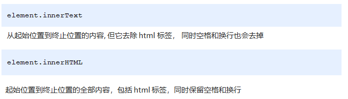
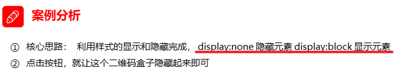
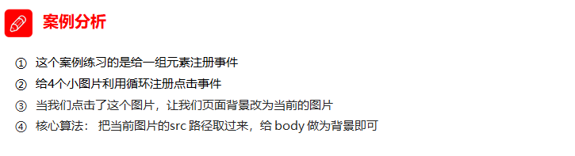
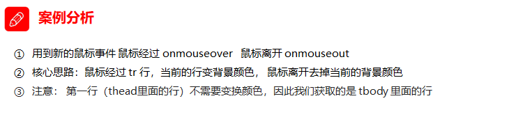
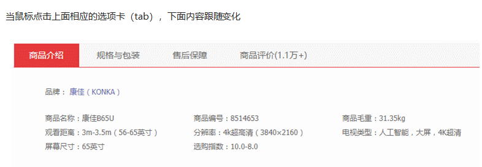
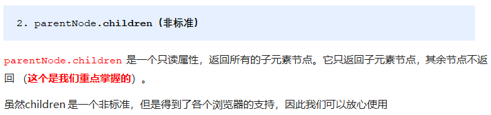
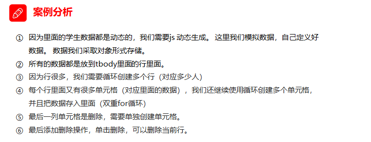
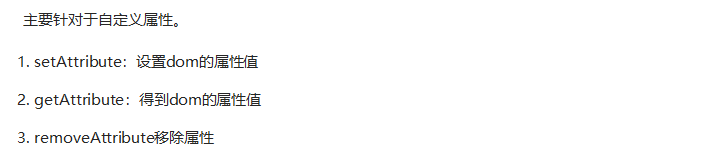
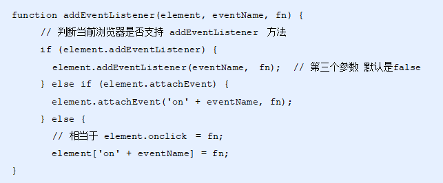

# JS_Web APIs介绍

## 1.1. Web API介绍

### 1.1.1 API的概念

API（Application Programming Interface，应用程序编程接口）是一些预先定义的函数，目的是提供应用程序与开发人员基于某软件或硬件得以访问一组例程的能力，而又无需访问源码，无需理解其内部工作机制细节，只需直接调用使用即可。

> 举例解释什么是API。
>
> 例如，
>
> ​	C语言中有一个函数 fopen()可以打开硬盘上的文件，这个函数对于我们来说，就是一个C语言提供的打开文件的工具。
>
> ​	javascript中有一个函数alert()可以在页面弹一个提示框，这个函数就是js提供的一个弹框工具。
>
> 这些工具（函数）由编程语言提供，内部的实现已经封装好了，我们只要学会灵活的使用这些工具即可。

### 1.1.2 Web  API的概念

​	Web API 是浏览器提供的一套操作浏览器功能和页面元素的 API ( BOM 和 DOM )。

​	现阶段我们主要针对于浏览器讲解常用的 API , 主要针对浏览器做交互效果。比如我们想要浏览器弹出一个警示框， 直接使用 alert(‘弹出’)

​	MDN 详细 API : https://developer.mozilla.org/zh-CN/docs/Web/API

​	因为 Web API 很多，所以我们将这个阶段称为 Web APIs。

​	此处的 Web API 特指浏览器提供的一系列API(很多函数或对象方法)，即操作网页的一系列工具。例如：操作html标签、操作页面地址的方法。

### 1.1.3 API 和 Web  API 总结

1. API 是为我们程序员提供的一个接口，帮助我们实现某种功能，我们会使用就可以了，不必纠结内部如何实现

2. Web API 主要是针对于浏览器提供的接口，主要针对于浏览器做交互效果。

3. Web API 一般都有输入和输出（函数的传参和返回值），Web API 很多都是方法（函数）

4. 学习 Web API 可以结合前面学习内置对象方法的思路学习

## 1.2. DOM 介绍

### 1.2.1 什么是DOM

​	文档对象模型（Document Object Model，简称DOM），是 [W3C](https://baike.baidu.com/item/W3C) 组织推荐的处理[可扩展标记语言](https://baike.baidu.com/item/%E5%8F%AF%E6%89%A9%E5%B1%95%E7%BD%AE%E6%A0%87%E8%AF%AD%E8%A8%80)（html或者xhtml）的标准[编程接口](https://baike.baidu.com/item/%E7%BC%96%E7%A8%8B%E6%8E%A5%E5%8F%A3)。

​	W3C 已经定义了一系列的 DOM 接口，通过这些 DOM 接口可以改变网页的内容、结构和样式。

> DOM是W3C组织制定的一套处理 html和xml文档的规范，所有的浏览器都遵循了这套标准。

### 1.2.2. DOM树


DOM树 又称为文档树模型，把文档映射成树形结构，通过节点对象对其处理，处理的结果可以加入到当前的页面。

- 文档：一个页面就是一个文档，DOM中使用document表示
- 节点：网页中的所有内容，在文档树中都是节点（标签、属性、文本、注释等），使用node表示
- 标签节点：网页中的所有标签，通常称为元素节点，又简称为“元素”，使用element表示


## 1.3. 获取元素

为什么要获取页面元素？

例如：我们想要操作页面上的某部分(显示/隐藏，动画)，需要先获取到该部分对应的元素，再对其进行操作。

### 1.3.1. 根据ID获取

```js
语法：document.getElementById(id)
作用：根据ID获取元素对象
参数：id值，区分大小写的字符串
返回值：元素对象 或 null
```

**案例代码**

```js
<body>
    <div id="time">2019-9-9</div>
    <script>
        // 因为我们文档页面从上往下加载，所以先得有标签 所以我们script写到标签的下面
        var timer = document.getElementById('time');
        console.log(timer);
        console.log(typeof timer);
        // console.dir 打印我们返回的元素对象 更好的查看里面的属性和方法
        console.dir(timer);
    </script>
</body>
```

### 1.3.2. 根据标签名获取元素

```
语法：document.getElementsByTagName('标签名') 或者 element.getElementsByTagName('标签名') 
作用：根据标签名获取元素对象
参数：标签名
返回值：元素对象集合（伪数组，数组元素是元素对象）
```

**案例代码**

```javascript
<body>
    <ul>
        <li>知否知否，应是等你好久11</li>
        <li>知否知否，应是等你好久22</li>
        <li>知否知否，应是等你好久33</li>
        <li>知否知否，应是等你好久44</li>
        <li>知否知否，应是等你好久55</li>
    </ul>
    <ul id="nav">
        <li>生僻字</li>
        <li>生僻字</li>
        <li>生僻字</li>
        <li>生僻字</li>
        <li>生僻字</li>
    </ul>
    <script>
        // 1.返回的是 获取过来元素对象的集合 以伪数组的形式存储的
        var lis = document.getElementsByTagName('li');
        console.log(lis);
        console.log(lis[0]);
        // 2. 我们想要依次打印里面的元素对象我们可以采取遍历的方式
        for (var i = 0; i < lis.length; i++) {
            console.log(lis[i]);
        }
        // 3. element.getElementsByTagName()  可以得到这个元素里面的某些标签
        var nav = document.getElementById('nav'); // 这个获得nav 元素
        var navLis = nav.getElementsByTagName('li');
        console.log(navLis);
    </script>
</body>
```


注意：getElementsByTagName()获取到是动态集合，即：当页面增加了标签，这个集合中也就增加了元素。

### 1.3.3. H5新增获取元素方式


**案例代码**

```js
<body>
    <div class="box">盒子1</div>
    <div class="box">盒子2</div>
    <div id="nav">
        <ul>
            <li>首页</li>
            <li>产品</li>
        </ul>
    </div>
    <script>
        // 1. getElementsByClassName 根据类名获得某些元素集合
        var boxs = document.getElementsByClassName('box');
        console.log(boxs);
        // 2. querySelector 返回指定选择器的第一个元素对象  切记 里面的选择器需要加符号 .box  #nav
        var firstBox = document.querySelector('.box');
        console.log(firstBox);
        var nav = document.querySelector('#nav');
        console.log(nav);
        var li = document.querySelector('li');
        console.log(li);
        // 3. querySelectorAll()返回指定选择器的所有元素对象集合
        var allBox = document.querySelectorAll('.box');
        console.log(allBox);
        var lis = document.querySelectorAll('li');
        console.log(lis);
    </script>
</body>
```

### 1.3.4 获取特殊元素（body，html）


## 1.4. 事件基础

### 1.4.1. 事件概述

JavaScript 使我们有能力创建动态页面，而事件是可以被 JavaScript 侦测到的行为。

简单理解： **触发--- 响应机制**。

​	网页中的每个元素都可以产生某些可以触发 JavaScript 的事件，例如，我们可以在用户点击某按钮时产生一个 事件，然后去执行某些操作。

### 1.4.2. 事件三要素

- 事件源（谁）：触发事件的元素
- 事件类型（什么事件）： 例如 click 点击事件
- 事件处理程序（做啥）：事件触发后要执行的代码(函数形式)，事件处理函数

**案例代码**

```js
<body>
    <button id="btn">唐伯虎</button>
    <script>
        // 点击一个按钮，弹出对话框
        // 1. 事件是有三部分组成  事件源  事件类型  事件处理程序   我们也称为事件三要素
        //(1) 事件源 事件被触发的对象   谁  按钮
        var btn = document.getElementById('btn');
        //(2) 事件类型  如何触发 什么事件 比如鼠标点击(onclick) 还是鼠标经过 还是键盘按下
        //(3) 事件处理程序  通过一个函数赋值的方式 完成
        btn.onclick = function() {
            alert('点秋香');
        }
    </script>
</body>
```

### 1.4.3. 执行事件的步骤


**案例代码**

```js
<body>
    <div>123</div>
    <script>
        // 执行事件步骤
        // 点击div 控制台输出 我被选中了
        // 1. 获取事件源
        var div = document.querySelector('div');
        // 2.绑定事件 注册事件
        // div.onclick 
        // 3.添加事件处理程序 
        div.onclick = function() {
            console.log('我被选中了');
        }
    </script>
</body>
```

### 1.4.4. 常见的鼠标事件


### 1.4.5. 分析事件三要素

- 下拉菜单三要素

- 关闭广告三要素

## 1.5. 操作元素

​	JavaScript的 DOM 操作可以改变网页内容、结构和样式，我们可以利用 DOM 操作元素来改变元素里面的内容、属性等。（注意：这些操作都是通过元素对象的属性实现的）

### 1.5.1. 改变元素内容（获取或设置）



**innerText改变元素内容**

```js
<body>
    <button>显示当前系统时间</button>
    <div>某个时间</div>
    <p>1123</p>
    <script>
        // 当我们点击了按钮，  div里面的文字会发生变化
        // 1. 获取元素 
        var btn = document.querySelector('button');
        var div = document.querySelector('div');
        // 2.注册事件
        btn.onclick = function() {
            // div.innerText = '2019-6-6';
            div.innerHTML = getDate();
        }
        function getDate() {
            var date = new Date();
            // 我们写一个 2019年 5月 1日 星期三
            var year = date.getFullYear();
            var month = date.getMonth() + 1;
            var dates = date.getDate();
            var arr = ['星期日', '星期一', '星期二', '星期三', '星期四', '星期五', '星期六'];
            var day = date.getDay();
            return '今天是：' + year + '年' + month + '月' + dates + '日 ' + arr[day];
        }
    </script>
</body>
```

**innerText和innerHTML的区别**

- 获取内容时的区别：

​	innerText会去除空格和换行，而innerHTML会保留空格和换行	

- 设置内容时的区别：

​	innerText不会识别html，而innerHTML会识别

**案例代码**

```js
<body>
    <div></div>
    <p>
        我是文字
        <span>123</span>
    </p>
    <script>
        // innerText 和 innerHTML的区别 
        // 1. innerText 不识别html标签 非标准  去除空格和换行
        var div = document.querySelector('div');
        // div.innerText = '<strong>今天是：</strong> 2019';
        // 2. innerHTML 识别html标签 W3C标准 保留空格和换行的
        div.innerHTML = '<strong>今天是：</strong> 2019';
        // 这两个属性是可读写的  可以获取元素里面的内容
        var p = document.querySelector('p');
        console.log(p.innerText);
        console.log(p.innerHTML);
    </script>
</body>
```

### 1.5.2. 常用元素的属性操作


**获取属性的值**

> 元素对象.属性名

**设置属性的值**

> 元素对象.属性名 = 值

**案例代码**

```js
<body>
    <button id="ldh">刘德华</button>
    <button id="zxy">张学友</button> <br>
    
    <script>
        // 修改元素属性  src
        // 1. 获取元素
        var ldh = document.getElementById('ldh');
        var zxy = document.getElementById('zxy');
        var img = document.querySelector('img');
        // 2. 注册事件  处理程序
        zxy.onclick = function() {
            img.src = 'images/zxy.jpg';
            img.title = '张学友思密达';
        }
        ldh.onclick = function() {
            img.src = 'images/ldh.jpg';
            img.title = '刘德华';
        }
    </script>
</body>
```


### 1.5.3. 案例：分时问候


### 1.5.4. 表单元素的属性操作


**获取属性的值**

> 元素对象.属性名

**设置属性的值**

> 元素对象.属性名 = 值
>
> 表单元素中有一些属性如：disabled、checked、selected，元素对象的这些属性的值是布尔型。

**案例代码**

```js
<body>
    <button>按钮</button>
    <input type="text" value="输入内容">
    <script>
        // 1. 获取元素
        var btn = document.querySelector('button');
        var input = document.querySelector('input');
        // 2. 注册事件 处理程序
        btn.onclick = function() {
            // 表单里面的值 文字内容是通过 value 来修改的
            input.value = '被点击了';
            // 如果想要某个表单被禁用 不能再点击 disabled  我们想要这个按钮 button禁用
            // btn.disabled = true;
            this.disabled = true;
            // this 指向的是事件函数的调用者 btn
        }
    </script>
</body>
```

### 1.5.5. 案例：仿京东显示密码


### 1.5.6. 样式属性操作

我们可以通过 JS 修改元素的大小、颜色、位置等样式。

**常用方式**


#### 方式1：通过操作style属性

> 元素对象的style属性也是一个对象！
>
> 元素对象.style.样式属性 = 值;


**案例代码**

```js
<body>
    <div></div>
    <script>
        // 1. 获取元素
        var div = document.querySelector('div');
        // 2. 注册事件 处理程序
        div.onclick = function() {
            // div.style里面的属性 采取驼峰命名法 
            this.style.backgroundColor = 'purple';
            this.style.width = '250px';
        }
    </script>
</body>
```

#### 案例：淘宝点击关闭二维码




#### 案例：循环精灵图背景


#### 案例：显示隐藏文本框内容


#### 方式2：通过操作className属性

> 元素对象.className = 值;
>
> 因为class是关键字，所有使用className。


**案例代码**

```js
<body>
    <div class="first">文本</div>
    <script>
        // 1. 使用 element.style 获得修改元素样式  如果样式比较少 或者 功能简单的情况下使用
        var test = document.querySelector('div');
        test.onclick = function() {
            // this.style.backgroundColor = 'purple';
            // this.style.color = '#fff';
            // this.style.fontSize = '25px';
            // this.style.marginTop = '100px';

            // 2. 我们可以通过 修改元素的className更改元素的样式 适合于样式较多或者功能复杂的情况
            // 3. 如果想要保留原先的类名，我们可以这么做 多类名选择器
            // this.className = 'change';
            this.className = 'first change';
        }
    </script>
</body>
```

#### 案例：密码框格式提示错误信息


## 1.6. 以上总结


## 1.7. 排他操作

### 1.7.1 排他思想


如果有同一组元素，我们想要某一个元素实现某种样式， 需要用到循环的排他思想算法：

1. 所有元素全部清除样式（干掉其他人）

2. 给当前元素设置样式 （留下我自己）

3. 注意顺序不能颠倒，首先干掉其他人，再设置自己

```js
    <button>按钮1</button>
    <button>按钮2</button>
    <button>按钮3</button>
    <button>按钮4</button>
    <button>按钮5</button>
    <script>
        // 1. 获取所有按钮元素
        var btns = document.getElementsByTagName('button');
        // btns得到的是伪数组  里面的每一个元素 btns[i]
        for (var i = 0; i < btns.length; i++) {
            btns[i].onclick = function() {
                // (1) 我们先把所有的按钮背景颜色去掉  干掉所有人
                for (var i = 0; i < btns.length; i++) {
                    btns[i].style.backgroundColor = '';
                }
                // (2) 然后才让当前的元素背景颜色为pink 留下我自己
                this.style.backgroundColor = 'pink';

            }
        }
    </script>
```


## 1.8 案例：百度换肤




```js
<body>
    <ul class="baidu">
        <li></li>
        <li></li>
        <li></li>
        <li></li>
    </ul>
    <script>
        // 1. 获取元素 
        var imgs = document.querySelector('.baidu').querySelectorAll('img');
        // console.log(imgs);
        // 2. 循环注册事件 
        for (var i = 0; i < imgs.length; i++) {
            imgs[i].onclick = function() {
                // this.src 就是我们点击图片的路径   images/2.jpg
                // console.log(this.src);
                // 把这个路径 this.src 给body 就可以了
                document.body.style.backgroundImage = 'url(' + this.src + ')';
            }
        }
    </script>
</body>
```

## 1.9 案例：表格隔行变色




```js
    <script>
        // 1.获取元素 获取的是 tbody 里面所有的行
        var trs = document.querySelector('tbody').querySelectorAll('tr');
        // 2. 利用循环绑定注册事件
        for (var i = 0; i < trs.length; i++) {
            // 3. 鼠标经过事件 onmouseover
            trs[i].onmouseover = function() {
                    // console.log(11);
                    this.className = 'bg';
                }
                // 4. 鼠标离开事件 onmouseout
            trs[i].onmouseout = function() {
                this.className = '';
            }
        }
    </script>
```

## 1.10 案例：全选


```js
    <script>
        // 1. 全选和取消全选做法：  让下面所有复选框的checked属性（选中状态） 跟随 全选按钮即可
        // 获取元素
        
        var j_cbAll = document.getElementById('j_cbAll'); 
        var j_tbs = document.getElementById('j_tb').getElementsByTagName('input'); 
        // 全选按钮注册事件
        j_cbAll.onclick = function() {
                // this.checked 当前复选框的选中状态
                console.log(this.checked);
                for (var i = 0; i < j_tbs.length; i++) {
                    j_tbs[i].checked = this.checked;
                }
         }
         // 给所有的子复选框注册单击事件
        for (var i = 0; i < j_tbs.length; i++) {
            j_tbs[i].onclick = function() {
                // flag 控制全选按钮是否选中
                var flag = true;
                // 每次点击下面的复选框都要循环检查者4个小按钮是否全被选中
                for (var i = 0; i < j_tbs.length; i++) {
                    if (!j_tbs[i].checked) {
                        flag = false;
                        break; 
                    }
                }
                // 设置全选按钮的状态
                j_cbAll.checked = flag;
            }
        }
    </script>
```


## 1.11. 自定义属性操作

### 1.11.1 获取属性值


```js
    <div id="demo" index="1" class="nav"></div>
    <script>
        var div = document.querySelector('div');
        // 1. 获取元素的属性值
        // (1) element.属性
        console.log(div.id);
        //(2) element.getAttribute('属性')  get得到获取 attribute 属性的意思 我们程序员自己添加的属性我们称为自定义属性 index
        console.log(div.getAttribute('id'));
        console.log(div.getAttribute('index'));
	</script>
```


### 1.11.2. 设置属性值


```js
        // 2. 设置元素属性值
        // (1) element.属性= '值'
        div.id = 'test';
        div.className = 'navs';
        // (2) element.setAttribute('属性', '值');  主要针对于自定义属性
        div.setAttribute('index', 2);
        div.setAttribute('class', 'footer'); // class 特殊  这里面写的就是
```


### 1.11.3. 移出属性


```js
		// class 不是className
        // 3 移除属性 removeAttribute(属性)    
        div.removeAttribute('index');
```


### 1.11.4. 案例：tab栏




```js
    <script>
        // 获取元素
        var tab_list = document.querySelector('.tab_list');
        var lis = tab_list.querySelectorAll('li');
        var items = document.querySelectorAll('.item');
        // for循环，给选项卡绑定点击事件
        for (var i = 0; i < lis.length; i++) {
            // 开始给5个小li 设置索引号 
            lis[i].setAttribute('index', i);
            lis[i].onclick = function() {
                // 1. 上的模块选项卡，当前这一个底色会是红色，其余不变（排他思想）
                // 干掉所有人 其余的li清除 class 这个类
                for (var i = 0; i < lis.length; i++) {
                    lis[i].className = '';
                }
                // 留下我自己 
                this.className = 'current';
                // 2. 下面的显示内容模块
                var index = this.getAttribute('index');
                console.log(index);
                // 干掉所有人 让其余的item 这些div 隐藏
                for (var i = 0; i < items.length; i++) {
                    items[i].style.display = 'none';
                }
                // 留下我自己 让对应的item 显示出来
                items[index].style.display = 'block';
            }
        }
    </script>
```


### 1.11.5. H5自定义属性

自定义属性目的：是为了保存并使用数据。有些数据可以保存到页面中而不用保存到数据库中。

自定义属性获取是通过getAttribute(‘属性’) 获取。

但是有些自定义属性很容易引起歧义，不容易判断是元素的内置属性还是自定义属性。

H5给我们新增了自定义属性：


```js
    <div getTime="20" data-index="2" data-list-name="andy"></div>
    <script>
        var div = document.querySelector('div');
        // console.log(div.getTime);
        console.log(div.getAttribute('getTime'));
        div.setAttribute('data-time', 20);
        console.log(div.getAttribute('data-index'));
        console.log(div.getAttribute('data-list-name'));
        // h5新增的获取自定义属性的方法 它只能获取data-开头的
        // dataset 是一个集合里面存放了所有以data开头的自定义属性
        console.log(div.dataset);
        console.log(div.dataset.index);
        console.log(div.dataset['index']);
        // 如果自定义属性里面有多个-链接的单词，我们获取的时候采取 驼峰命名法
        console.log(div.dataset.listName);
        console.log(div.dataset['listName']);
    </script>
```


## 1.12. 节点操作

### 1.12.1. 节点概述

​	网页中的所有内容都是节点（标签、属性、文本、注释等），在DOM 中，节点使用 node 来表示。

​	HTML DOM 树中的所有节点均可通过 JavaScript 进行访问，所有 HTML 元素（节点）均可被修改，也可以创建或删除。


​	一般地，节点至少拥有nodeType（节点类型）、nodeName（节点名称）和nodeValue（节点值）这三个基本属性。


### 1.12.2. 节点层级

​	利用 DOM 树可以把节点划分为不同的层级关系，常见的是**父子兄层级关系**。

​    

### 1.12.3. 父级节点


```js
    <div class="demo">
        <div class="box">
            <span class="erweima">×</span>
        </div>
    </div>
    <script>
        // 1. 父节点 parentNode
        var erweima = document.querySelector('.erweima');
        // var box = document.querySelector('.box');
        // 得到的是离元素最近的父级节点(亲爸爸) 如果找不到父节点就返回为 null
        console.log(erweima.parentNode);
    </script>
```

### 1.12.4. 子节点

**所有子节点**


**子元素节点**



```js
    <ul>
        <li>我是li</li>
        <li>我是li</li>
        <li>我是li</li>
        <li>我是li</li>
    </ul>
    <script>
        // DOM 提供的方法（API）获取
        var ul = document.querySelector('ul');
        var lis = ul.querySelectorAll('li');
        // 1. 子节点  childNodes 所有的子节点 包含 元素节点 文本节点等等
        console.log(ul.childNodes);
        console.log(ul.childNodes[0].nodeType);
        console.log(ul.childNodes[1].nodeType);
        // 2. children 获取所有的子元素节点 也是我们实际开发常用的
        console.log(ul.children);
    </script>
```

**第1个子节点**


**最后1个子节点**


**第1个子元素节点**


**最后1个子元素节点**


​	实际开发中，firstChild 和 lastChild 包含其他节点，操作不方便，而 firstElementChild 和 lastElementChild 又有兼容性问题，那么我们如何获取第一个子元素节点或最后一个子元素节点呢？


```js
    <ol>
        <li>我是li1</li>
        <li>我是li2</li>
        <li>我是li3</li>
        <li>我是li4</li>
        <li>我是li5</li>
    </ol>
    <script>
        var ol = document.querySelector('ol');
        // 1. firstChild 第一个子节点 不管是文本节点还是元素节点
        console.log(ol.firstChild);
        console.log(ol.lastChild);
        // 2. firstElementChild 返回第一个子元素节点 ie9才支持
        console.log(ol.firstElementChild);
        console.log(ol.lastElementChild);
        // 3. 实际开发的写法  既没有兼容性问题又返回第一个子元素
        console.log(ol.children[0]);
        console.log(ol.children[ol.children.length - 1]);
    </script>
```

### 1.12.5. 案例：新浪下拉菜单


```js
    <script>
        // 1. 获取元素
        var nav = document.querySelector('.nav');
        var lis = nav.children; // 得到4个小li
        // 2.循环注册事件
        for (var i = 0; i < lis.length; i++) {
            lis[i].onmouseover = function() {
                this.children[1].style.display = 'block';
            }
            lis[i].onmouseout = function() {
                this.children[1].style.display = 'none';
            }
        }
    </script>
```

### 1.12.6. 兄弟节点

**下一个兄弟节点**


**上一个兄弟节点**


```js
    <div>我是div</div>
    <span>我是span</span>
    <script>
        var div = document.querySelector('div');
        // 1.nextSibling 下一个兄弟节点 包含元素节点或者 文本节点等等
        console.log(div.nextSibling);
        console.log(div.previousSibling);
        // 2. nextElementSibling 得到下一个兄弟元素节点
        console.log(div.nextElementSibling);
        console.log(div.previousElementSibling);
    </script>
```

**下一个兄弟元素节点（有兼容性问题）**


**上一个兄弟元素节点（有兼容性问题）**


```js
   function getNextElementSibling(element) {
      var el = element;
      while (el = el.nextSibling) {
        if (el.nodeType === 1) {
            return el;
        }
      }
      return null;
    }  
```

### 1.12.7. 创建节点


### 1.12.8. 添加节点


```js
    <ul>
        <li>123</li>
    </ul>
    <script>
        // 1. 创建节点元素节点
        var li = document.createElement('li');
        // 2. 添加节点 node.appendChild(child)  node 父级  child 是子级 后面追加元素
        var ul = document.querySelector('ul');
        ul.appendChild(li);
        // 3. 添加节点 node.insertBefore(child, 指定元素);
        var lili = document.createElement('li');
        ul.insertBefore(lili, ul.children[0]);
        // 4. 我们想要页面添加一个新的元素 ： 1. 创建元素 2. 添加元素
    </script>
```

### 1.12.9. 案例：简单版发布留言


```js
<body>
    <textarea name="" id=""></textarea>
    <button>发布</button>
    <ul>

    </ul>
    <script>
        // 1. 获取元素
        var btn = document.querySelector('button');
        var text = document.querySelector('textarea');
        var ul = document.querySelector('ul');
        // 2. 注册事件
        btn.onclick = function() {
            if (text.value == '') {
                alert('您没有输入内容');
                return false;
            } else {
                // console.log(text.value);
                // (1) 创建元素
                var li = document.createElement('li');
                // 先有li 才能赋值
                li.innerHTML = text.value;
                // (2) 添加元素
                // ul.appendChild(li);
                ul.insertBefore(li, ul.children[0]);
            }
        }
    </script>
</body>
```

### 1.12.1 删除节点

.png)

node.removeChild() 方法从 node节点中删除一个子节点，返回删除的节点。

```js
    <button>删除</button>
    <ul>
        <li>熊大</li>
        <li>熊二</li>
        <li>光头强</li>
    </ul>
    <script>
        // 1.获取元素
        var ul = document.querySelector('ul');
        var btn = document.querySelector('button');
        // 2. 删除元素  node.removeChild(child)
        // ul.removeChild(ul.children[0]);
        // 3. 点击按钮依次删除里面的孩子
        btn.onclick = function() {
            if (ul.children.length == 0) {
                this.disabled = true;
            } else {
                ul.removeChild(ul.children[0]);
            }
        }
    </script>
```


### 1.12.2 案例：删除留言


```js
    <textarea name="" id=""></textarea>
    <button>发布</button>
    <ul>

    </ul>
    <script>
        // 1. 获取元素
        var btn = document.querySelector('button');
        var text = document.querySelector('textarea');
        var ul = document.querySelector('ul');
        // 2. 注册事件
        btn.onclick = function() {
            if (text.value == '') {
                alert('您没有输入内容');
                return false;
            } else {
                // console.log(text.value);
                // (1) 创建元素
                var li = document.createElement('li');
                // 先有li 才能赋值
                li.innerHTML = text.value + "<a href='javascript:;'>删除</a>";
                // (2) 添加元素
                // ul.appendChild(li);
                ul.insertBefore(li, ul.children[0]);
                // (3) 删除元素 删除的是当前链接的li  它的父亲
                var as = document.querySelectorAll('a');
                for (var i = 0; i < as.length; i++) {
                    as[i].onclick = function() {
                        // 删除的是 li 当前a所在的li  this.parentNode;
                        ul.removeChild(this.parentNode);
                    }
                }
            }
        }
    </script>
```

### 1.12.3 复制（克隆）节点


```js
    <ul>
        <li>1111</li>
        <li>2</li>
        <li>3</li>
    </ul>
    <script>
        var ul = document.querySelector('ul');
        // 1. node.cloneNode(); 括号为空或者里面是false 浅拷贝 只复制标签不复制里面的内容
        // 2. node.cloneNode(true); 括号为true 深拷贝 复制标签复制里面的内容
        var lili = ul.children[0].cloneNode(true);
        ul.appendChild(lili);
    </script>
```

### 1.12.4 案例：动态生成表格




```js
    <script>
        // 1.先去准备好学生的数据
        var datas = [{
            name: '魏璎珞',
            subject: 'JavaScript',
            score: 100
        }, {
            name: '弘历',
            subject: 'JavaScript',
            score: 98
        }, {
            name: '傅恒',
            subject: 'JavaScript',
            score: 99
        }, {
            name: '明玉',
            subject: 'JavaScript',
            score: 88
        }, {
            name: '大猪蹄子',
            subject: 'JavaScript',
            score: 0
        }];
        // 2. 往tbody 里面创建行： 有几个人（通过数组的长度）我们就创建几行
        var tbody = document.querySelector('tbody');
		// 遍历数组
        for (var i = 0; i < datas.length; i++) { 
            // 1. 创建 tr行
            var tr = document.createElement('tr');
            tbody.appendChild(tr);
            // 2. 行里面创建单元格td 单元格的数量取决于每个对象里面的属性个数  
            // 使用for in遍历学生对象
            for (var k in datas[i]) { 
                // 创建单元格 
                var td = document.createElement('td');
                // 把对象里面的属性值 datas[i][k] 给 td  
                td.innerHTML = datas[i][k];
                tr.appendChild(td);
            }
            // 3. 创建有删除2个字的单元格 
            var td = document.createElement('td');
            td.innerHTML = '<a href="javascript:;">删除 </a>';
            tr.appendChild(td);

        }
        // 4. 删除操作 开始 
        var as = document.querySelectorAll('a');
        for (var i = 0; i < as.length; i++) {
            as[i].onclick = function() {
                // 点击a 删除 当前a 所在的行(链接的爸爸的爸爸)  node.removeChild(child)  
                tbody.removeChild(this.parentNode.parentNode)
            }
        }
    </script>
```


### 1.12.5 创建元素的三种方式


```js
    <script>
        // 三种创建元素方式区别 
        // 1. document.write() 创建元素  如果页面文档流加载完毕，再调用这句话会导致页面重绘
         var btn = document.querySelector('button');
         btn.onclick = function() {
             document.write('<div>123</div>');
         }

        // 2. innerHTML 创建元素
        var inner = document.querySelector('.inner');
         for (var i = 0; i <= 100; i++) {
             inner.innerHTML += '<a href="#">百度</a>'
         }
        var arr = [];
        for (var i = 0; i <= 100; i++) {
            arr.push('<a href="#">百度</a>');
        }
        inner.innerHTML = arr.join('');
        // 3. document.createElement() 创建元素
        var create = document.querySelector('.create');
        for (var i = 0; i <= 100; i++) {
            var a = document.createElement('a');
            create.appendChild(a);
        }
    </script>
```


### 1.12.6 innerTHML和createElement效率对比

**innerHTML字符串拼接方式（效率低）**

```js
<script>
    function fn() {
        var d1 = +new Date();
        var str = '';
        for (var i = 0; i < 1000; i++) {
            document.body.innerHTML += '<div style="width:100px; height:2px; border:1px solid blue;"></div>';
        }
        var d2 = +new Date();
        console.log(d2 - d1);
    }
    fn();
</script>
```

**createElement方式（效率一般）**

```js
<script>
    function fn() {
        var d1 = +new Date();

        for (var i = 0; i < 1000; i++) {
            var div = document.createElement('div');
            div.style.width = '100px';
            div.style.height = '2px';
            div.style.border = '1px solid red';
            document.body.appendChild(div);
        }
        var d2 = +new Date();
        console.log(d2 - d1);
    }
    fn();
</script>
```

**innerHTML数组方式（效率高）**

```js
<script>
    function fn() {
        var d1 = +new Date();
        var array = [];
        for (var i = 0; i < 1000; i++) {
            array.push('<div style="width:100px; height:2px; border:1px solid blue;"></div>');
        }
        document.body.innerHTML = array.join('');
        var d2 = +new Date();
        console.log(d2 - d1);
    }
    fn();
</script>
```


## 1.13. DOM的核心总结


关于dom操作，我们主要针对于元素的操作。主要有创建、增、删、改、查、属性操作、事件操作。

### 1.13.1. 创建


### 1.13.2. 增加


### 1.13.3. 删


### 1.13.4. 改


### 1.13.5. 查


### 1.13.6. 属性操作



### 1.2.7. 事件操作（重点）


## JS-事件

## 1.1. 事件高级

### 1.1.1. 注册事件（2种方式）


### 1.1.2 事件监听

#### addEventListener()事件监听（IE9以后支持）


eventTarget.addEventListener()方法将指定的监听器注册到 eventTarget（目标对象）上，当该对象触发指定的事件时，就会执行事件处理函数。


#### attacheEvent()事件监听（IE678支持）


​	eventTarget.attachEvent()方法将指定的监听器注册到 eventTarget（目标对象） 上，当该对象触发指定的事件时，指定的回调函数就会被执行。


```js
<button>传统注册事件</button>
<button>方法监听注册事件</button>
<button>ie9 attachEvent</button>
<script>
    var btns = document.querySelectorAll('button');
    // 1. 传统方式注册事件
    btns[0].onclick = function() {
        alert('hi');
    }
    btns[0].onclick = function() {
            alert('hao a u');
        }
   // 2. 事件侦听注册事件 addEventListener 
   // (1) 里面的事件类型是字符串 必定加引号 而且不带on
   // (2) 同一个元素 同一个事件可以添加多个侦听器（事件处理程序）
    btns[1].addEventListener('click', function() {
        alert(22);
    })
    btns[1].addEventListener('click', function() {
            alert(33);
    })
    // 3. attachEvent ie9以前的版本支持
    btns[2].attachEvent('onclick', function() {
        alert(11);
    })
</script>
```

#### 事件监听兼容性解决方案

封装一个函数，函数中判断浏览器的类型：



### 1.1.3. 删除事件（解绑事件）


```js
    <div>1</div>
    <div>2</div>
    <div>3</div>
    <script>
        var divs = document.querySelectorAll('div');
        divs[0].onclick = function() {
            alert(11);
            // 1. 传统方式删除事件
            divs[0].onclick = null;
        }
        // 2. removeEventListener 删除事件
        divs[1].addEventListener('click', fn) // 里面的fn 不需要调用加小括号
        function fn() {
            alert(22);
            divs[1].removeEventListener('click', fn);
        }
        // 3. detachEvent
        divs[2].attachEvent('onclick', fn1);

        function fn1() {
            alert(33);
            divs[2].detachEvent('onclick', fn1);
        }
    </script>
```

**删除事件兼容性解决方案 **


### 1.1.4. DOM事件流

> ```
> html中的标签都是相互嵌套的，我们可以将元素想象成一个盒子装一个盒子，document是最外面的大盒子。当你单击一个div时，同时你也单击了div的父元素，甚至整个页面。那么是先执行父元素的单击事件，还是先执行div的单击事件 ？？？
> ```


> 比如：我们给页面中的一个div注册了单击事件，当你单击了div时，也就单击了body，单击了html，单击了document。


> ```
> 当时的2大浏览器霸主谁也不服谁！IE 提出从目标元素开始，然后一层一层向外接收事件并响应，也就是冒泡型事件流。Netscape（网景公司）提出从最外层开始，然后一层一层向内接收事件并响应，也就是捕获型事件流。江湖纷争，武林盟主也脑壳疼！！！最终，w3c 采用折中的方式，平息了战火，制定了统一的标准 —--— 先捕获再冒泡。现代浏览器都遵循了此标准，所以当事件发生时，会经历3个阶段。
> ```

DOM 事件流会经历3个阶段： 

1. 捕获阶段

2. 当前目标阶段

3. 冒泡阶段 


​	我们向水里面扔一块石头，首先它会有一个下降的过程，这个过程就可以理解为从最顶层向事件发生的最具体元素（目标点）的捕获过程；之后会产生泡泡，会在最低点（ 最具体元素）之后漂浮到水面上，这个过程相当于事件冒泡。 


**事件冒泡**

```js
    <div class="father">
        <div class="son">son盒子</div>
    </div>
    <script>
        // onclick 和 attachEvent（ie） 在冒泡阶段触发
        // 冒泡阶段 如果addEventListener 第三个参数是 false 或者 省略 
        // son -> father ->body -> html -> document
        var son = document.querySelector('.son');
		// 给son注册单击事件
        son.addEventListener('click', function() {
            alert('son');
        }, false);
		// 给father注册单击事件
        var father = document.querySelector('.father');
        father.addEventListener('click', function() {
            alert('father');
        }, false);
		// 给document注册单击事件，省略第3个参数
        document.addEventListener('click', function() {
            alert('document');
        })
    </script>
```

**事件捕获**

```js
    <div class="father">
        <div class="son">son盒子</div>
    </div>
    <script>
        // 如果addEventListener() 第三个参数是 true 那么在捕获阶段触发
        // document -> html -> body -> father -> son
         var son = document.querySelector('.son');
		// 给son注册单击事件，第3个参数为true
         son.addEventListener('click', function() {
             alert('son');
         }, true);
         var father = document.querySelector('.father');
		// 给father注册单击事件，第3个参数为true
         father.addEventListener('click', function() {
             alert('father');
         }, true);
		// 给document注册单击事件，第3个参数为true
        document.addEventListener('click', function() {
            alert('document');
        }, true)
    </script>
```

### 1.1.5. 事件对象

#### 什么是事件对象

事件发生后，跟事件相关的一系列信息数据的集合都放到这个对象里面，这个对象就是事件对象。

比如：  

1. 谁绑定了这个事件。

2. 鼠标触发事件的话，会得到鼠标的相关信息，如鼠标位置。

3. 键盘触发事件的话，会得到键盘的相关信息，如按了哪个键。

#### 事件对象的使用

事件触发发生时就会产生事件对象，并且系统会以实参的形式传给事件处理函数。

所以，在事件处理函数中声明1个形参用来接收事件对象。


#### 事件对象的兼容性处理

事件对象本身的获取存在兼容问题：

1. 标准浏览器中是浏览器给方法传递的参数，只需要定义形参 e 就可以获取到。

2. 在 IE6~8 中，浏览器不会给方法传递参数，如果需要的话，需要到 window.event 中获取查找。


```
只要“||”前面为false, 不管“||”后面是true 还是 false，都返回 “||” 后面的值。只要“||”前面为true, 不管“||”后面是true 还是 false，都返回 “||” 前面的值。
```

```js
    <div>123</div>
    <script>
        var div = document.querySelector('div');
        div.onclick = function(e) {
                // 事件对象
                e = e || window.event;
                console.log(e);
        }
    </script>
```

#### 事件对象的属性和方法


#### e.target 和 this 的区别

-  this 是事件绑定的元素（绑定这个事件处理函数的元素） 。

-  e.target 是事件触发的元素。

> ```
> 常情况下terget 和 this是一致的，但有一种情况不同，那就是在事件冒泡时（父子元素有相同事件，单击子元素，父元素的事件处理函数也会被触发执行），	这时候this指向的是父元素，因为它是绑定事件的元素对象，	而target指向的是子元素，因为他是触发事件的那个具体元素对象。
> ```

```js
    <div>123</div>
    <script>
        var div = document.querySelector('div');
        div.addEventListener('click', function(e) {
            // e.target 和 this指向的都是div
            console.log(e.target);
            console.log(this);

        });
    </script>
```

事件冒泡下的e.target和this

```js
    <ul>
        <li>abc</li>
        <li>abc</li>
        <li>abc</li>
    </ul>
    <script>
        var ul = document.querySelector('ul');
        ul.addEventListener('click', function(e) {
              // 我们给ul 绑定了事件  那么this 就指向ul  
              console.log(this); // ul

              // e.target 触发了事件的对象 我们点击的是li e.target 指向的就是li
              console.log(e.target); // li
        });
    </script>
```

### 1.1.6 阻止默认行为

> html中一些标签有默认行为，例如a标签被单击后，默认会进行页面跳转。

```js
    <a href="http://www.baidu.com">百度</a>
    <script>
        // 2. 阻止默认行为 让链接不跳转 
        var a = document.querySelector('a');
        a.addEventListener('click', function(e) {
             e.preventDefault(); //  dom 标准写法
        });
        // 3. 传统的注册方式
        a.onclick = function(e) {
            // 普通浏览器 e.preventDefault();  方法
            e.preventDefault();
            // 低版本浏览器 ie678  returnValue  属性
            e.returnValue = false;
            // 我们可以利用return false 也能阻止默认行为 没有兼容性问题
            return false;
        }
    </script>
```

### 1.1.7 阻止事件冒泡

事件冒泡本身的特性，会带来的坏处，也会带来的好处。


```js
    <div class="father">
        <div class="son">son儿子</div>
    </div>
    <script>
        var son = document.querySelector('.son');
		// 给son注册单击事件
        son.addEventListener('click', function(e) {
            alert('son');
            e.stopPropagation(); // stop 停止  Propagation 传播
            window.event.cancelBubble = true; // 非标准 cancel 取消 bubble 泡泡
        }, false);

        var father = document.querySelector('.father');
		// 给father注册单击事件
        father.addEventListener('click', function() {
            alert('father');
        }, false);
		// 给document注册单击事件
        document.addEventListener('click', function() {
            alert('document');
        })
    </script>
```

**阻止事件冒泡的兼容性处理**


### 1.1.8 事件委托

事件冒泡本身的特性，会带来的坏处，也会带来的好处。

#### 什么是事件委托

```
把事情委托给别人，代为处理。
```

事件委托也称为事件代理，在 jQuery 里面称为事件委派。

> 说白了就是，不给子元素注册事件，给父元素注册事件，把处理代码在父元素的事件中执行。


**生活中的代理：**


**js事件中的代理：**


#### 事件委托的原理

​	给父元素注册事件，利用事件冒泡，当子元素的事件触发，会冒泡到父元素，然后去控制相应的子元素。

#### 事件委托的作用

- 我们只操作了一次 DOM ，提高了程序的性能。

- 动态新创建的子元素，也拥有事件。

```js
    <ul>
        <li>知否知否，点我应有弹框在手！</li>
        <li>知否知否，点我应有弹框在手！</li>
        <li>知否知否，点我应有弹框在手！</li>
        <li>知否知否，点我应有弹框在手！</li>
        <li>知否知否，点我应有弹框在手！</li>
    </ul>
    <script>
        // 事件委托的核心原理：给父节点添加侦听器， 利用事件冒泡影响每一个子节点
        var ul = document.querySelector('ul');
        ul.addEventListener('click', function(e) {
            // e.target 这个可以得到我们点击的对象
            e.target.style.backgroundColor = 'pink';
        })
    </script>
```

## 1.2. 常用鼠标事件


### 1.2.1 案例：禁止选中文字和禁止右键菜单


```js
<body>
    我是一段不愿意分享的文字
    <script>
        // 1. contextmenu 我们可以禁用右键菜单
        document.addEventListener('contextmenu', function(e) {
                e.preventDefault();
        })
        // 2. 禁止选中文字 selectstart
        document.addEventListener('selectstart', function(e) {
            e.preventDefault();
        })
    </script>
</body>
```

### 1.2.2 鼠标事件对象


### 1.2.3 获取鼠标在页面的坐标

```js
    <script>
        // 鼠标事件对象 MouseEvent
        document.addEventListener('click', function(e) {
            // 1. client 鼠标在可视区的x和y坐标
            console.log(e.clientX);
            console.log(e.clientY);
            console.log('---------------------');

            // 2. page 鼠标在页面文档的x和y坐标
            console.log(e.pageX);
            console.log(e.pageY);
            console.log('---------------------');

            // 3. screen 鼠标在电脑屏幕的x和y坐标
            console.log(e.screenX);
            console.log(e.screenY);

        })
    </script>
```

### 1.2.4 案例：跟随鼠标的天使


```js
    
    <script>
        var pic = document.querySelector('img');
        document.addEventListener('mousemove', function(e) {
        	// 1. mousemove只要我们鼠标移动1px 就会触发这个事件
        	// 2.核心原理： 每次鼠标移动，我们都会获得最新的鼠标坐标， 
            // 把这个x和y坐标做为图片的top和left 值就可以移动图片
        	var x = e.pageX;
        	var y = e.pageY;
        	console.log('x坐标是' + x, 'y坐标是' + y);
        	//3 . 千万不要忘记给left 和top 添加px 单位
        	pic.style.left = x - 50 + 'px';
        	pic.style.top = y - 40 + 'px';
    	});
    </script>
```

