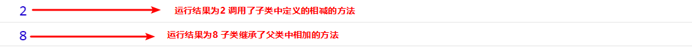
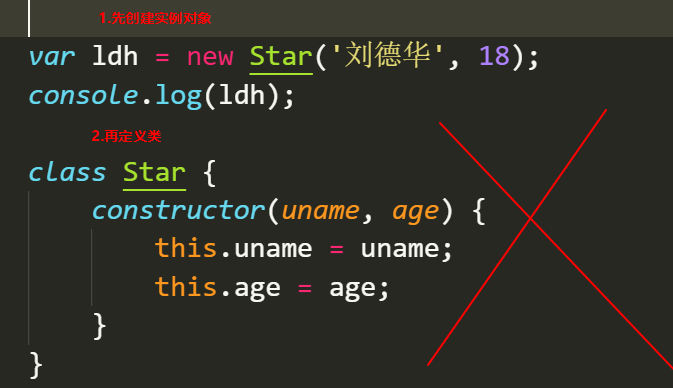
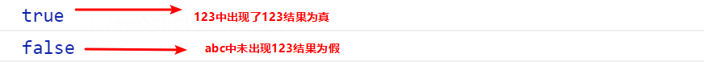
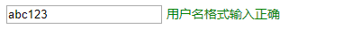
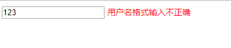
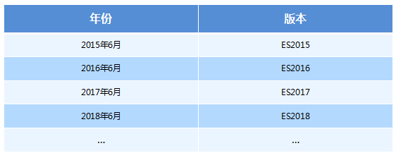

# JavaScript高级第01天

## 1.面向过程与面向对象

### 1.1面向过程

- 面向过程就是分析出解决问题所需要的步骤，然后用函数把这些步骤一步一步实现，使用的时候再一个一个的依次调用就可以了。

### 1.2面向对象

- 面向对象是把事务分解成为一个个对象，然后由对象之间分工与合作。

### 1.3面向过程与面向对象对比

|      | 面向过程                                                     | 面向对象                                                     |
| ---- | ------------------------------------------------------------ | ------------------------------------------------------------ |
| 优点 | 性能比面向对象高，适合跟硬件联系很紧密的东西，例如单片机就采用的面向过程编程。 | 易维护、易复用、易扩展，由于面向对象有封装、继承、多态性的特性，可以设计出低耦合的系统，使系统 更加灵活、更加易于维护 |
| 缺点 | 不易维护、不易复用、不易扩展                                 | 性能比面向过程低                                             |

## 2.对象与类

### 2.1对象

对象是由属性和方法组成的：是一个无序键值对的集合,指的是一个具体的事物

- 属性：事物的特征，在对象中用属性来表示（常用名词）
- 方法：事物的行为，在对象中用方法来表示（常用动词）

#### 2.1.1创建对象

```js
//以下代码是对对象的复习
//字面量创建对象
var ldh = {
    name: '刘德华',
    age: 18
}
console.log(ldh);

//构造函数创建对象
  function Star(name, age) {
    this.name = name;
    this.age = age;
 }
var ldh = new Star('刘德华', 18)//实例化对象
console.log(ldh);	
```

如上两行代码运行结果为:

### 2.2类

- 在 ES6 中新增加了类的概念，可以使用 class 关键字声明一个类，之后以这个类来实例化对象。类抽象了对象的公共部分，它泛指某一大类（class）对象特指某一个，通过类实例化一个具体的对象

#### 2.2.1创建类

1. 语法:

```js
//步骤1 使用class关键字
class name {
  // class body
}     
//步骤2使用定义的类创建实例  注意new关键字
var xx = new name();     
```

2. 示例

```js
 // 1. 创建类 class  创建一个 明星类
 class Star {
   // 类的共有属性放到 constructor 里面
   constructor(name, age) {
   this.name = name;
   this.age = age;
   }
 }
   // 2. 利用类创建对象 new
   var ldh = new Star('刘德华', 18);
   console.log(ldh);
```

以上代码运行结果: 


通过结果我们可以看出,运行结果和使用构造函数方式一样

#### 2.2.2类创建添加属性和方法

```js
 // 1. 创建类 class  创建一个类
class Star {
    // 类的共有属性放到 constructor 里面 constructor是 构造器或者构造函数
    constructor(uname, age) {
      this.uname = uname;
      this.age = age;
    }//------------------------------------------->注意,方法与方法之间不需要添加逗号
    sing(song) {
      console.log(this.uname + '唱' + song);
    }
}
// 2. 利用类创建对象 new
var ldh = new Star('刘德华', 18);
console.log(ldh); // Star {uname: "刘德华", age: 18}
ldh.sing('冰雨'); // 刘德华唱冰雨
```

 以上代码运行结果:


**注意哟:**

1. 通过class 关键字创建类, 类名我们还是习惯性定义首字母大写
2. 类里面有个constructor 函数,可以接受传递过来的参数,同时返回实例对象
3. constructor 函数 只要 new 生成实例时,就会自动调用这个函数, 如果我们不写这个函数,类也会自动生成这个函数
4. 多个函数方法之间不需要添加逗号分隔
5. 生成实例 new 不能省略
6. 语法规范, 创建类 类名后面不要加小括号,生成实例 类名后面加小括号, 构造函数不需要加function


#### 2.2.3类的继承

1. 语法

```js
// 父类
class Father{   
} 

// 子类继承父类
class  Son  extends Father {  
}       
```

2. 示例

```js
class Father {
      constructor(surname) {
        this.surname= surname;
      }
      say() {
        console.log('你的姓是' + this.surname);
       }
}

class Son extends Father{  // 这样子类就继承了父类的属性和方法
}
var damao= new Son('刘');
damao.say();      //结果为 你的姓是刘
```

以上代码运行结果:


- 子类使用super关键字访问父类的方法

  ```js
  //定义了父类
  class Father {
     constructor(x, y) {
     this.x = x;
     this.y = y;
     }
     sum() {
     console.log(this.x + this.y);
  	}
   }
  //子元素继承父类
      class Son extends Father {
     		 constructor(x, y) {
      		super(x, y); //使用super调用了父类中的构造函数
      	}
      }
      var son = new Son(1, 2);
      son.sum(); //结果为3
  ```

  **注意:** 

  1. 继承中,如果实例化子类输出一个方法,先看子类有没有这个方法,如果有就先执行子类的

  2. 继承中,如果子类里面没有,就去查找父类有没有这个方法,如果有,就执行父类的这个方法(就近原则)

  3. 如果子类想要继承父类的方法,同时在自己内部扩展自己的方法,利用super 调用父类的构造函数,super 必须在子类this之前调用

     ```js
      // 父类有加法方法
      class Father {
        constructor(x, y) {
        this.x = x;
        this.y = y;
        }
        sum() {
        console.log(this.x + this.y);
        }
      }
      // 子类继承父类加法方法 同时 扩展减法方法
      class Son extends Father {
        constructor(x, y) {
        // 利用super 调用父类的构造函数 super 必须在子类this之前调用,放到this之后会报错
        super(x, y);
        this.x = x;
        this.y = y;
     
       }
       subtract() {
       console.log(this.x - this.y);
       }
     }
     var son = new Son(5, 3);
     son.subtract(); //2
     son.sum();//8
     ```

     以上代码运行结果为:

     

  4. 时刻注意this的指向问题,类里面的共有的属性和方法一定要加this使用.

     1. constructor中的this指向的是new出来的实例对象 
     2. 自定义的方法,一般也指向的new出来的实例对象
     3. 绑定事件之后this指向的就是触发事件的事件源

  5. 在 ES6 中类没有变量提升，所以必须先定义类，才能通过类实例化对象

     ## 

## 3.面向对象版tab 栏切换

### 3.1功能需求

1. 点击 tab栏,可以切换效果.
2. 点击 + 号, 可以添加 tab 项和内容项.
3. 点击 x 号, 可以删除当前的tab项和内容项.
4. 双击tab项文字或者内容项文字可以修改里面的文字内容

### 3.2案例准备

1. 获取到标题元素
2. 获取到内容元素
3. 获取到删除的小按钮 x号
4. 新建js文件,定义类,添加需要的属性方法(切换,删除,增加,修改)
5. 时刻注意this的指向问题

### 3.3切换

- 为获取到的标题绑定点击事件,展示对应的内容区域,存储对应的索引

  ```js
   this.lis[i].index = i;
   this.lis[i].onclick = this.toggleTab;
  ```

- 使用排他,实现只有一个元素的显示

  ```js
   toggleTab() {
     //将所有的标题与内容类样式全部移除
       for (var i = 0; i < this.lis.length; i++) {
       this.lis[i].className = '';
       this.sections[i].className = '';
       }
     //为当前的标题添加激活样式
       this.className = 'liactive';
      //为当前的内容添加激活样式
       that.sections[this.index].className = 'conactive';
    }
  ```

### 3.4添加

- 为添加按钮+ 绑定点击事件 

  ```js
   this.add.onclick = this.addTab;
  ```

- 实现标题与内容的添加,做好排他处理

  ```js
  addTab() {
      that.clearClass();
      // (1) 创建li元素和section元素 
      var random = Math.random();
      var li = '<li class="liactive"><span>新选项卡</span><span class="iconfont icon-guanbi">				</span></li>';
      var section = '<section class="conactive">测试 ' + random + '</section>';
      // (2) 把这两个元素追加到对应的父元素里面
      that.ul.insertAdjacentHTML('beforeend', li);
      that.fsection.insertAdjacentHTML('beforeend', section);
      that.init();
      }
  ```

### 3.5删除

- 为元素的删除按钮x绑定点击事件

  ```js
   this.remove[i].onclick = this.removeTab;
  ```

- 获取到点击的删除按钮的所在的父元素的所有,删除对应的标题与内容

  ```js
   removeTab(e) {
       e.stopPropagation(); // 阻止冒泡 防止触发li 的切换点击事件
       var index = this.parentNode.index;
       console.log(index);
       // 根据索引号删除对应的li 和section   remove()方法可以直接删除指定的元素
       that.lis[index].remove();
       that.sections[index].remove();
       that.init();
       // 当我们删除的不是选中状态的li 的时候,原来的选中状态li保持不变
       if (document.querySelector('.liactive')) return;
       // 当我们删除了选中状态的这个li 的时候, 让它的前一个li 处于选定状态
       index--;
       // 手动调用我们的点击事件  不需要鼠标触发
       that.lis[index] && that.lis[index].click();
   }
  ```

### 3.6编辑

- 为元素(标题与内容)绑定双击事件

  ```js
   this.spans[i].ondblclick = this.editTab;
   this.sections[i].ondblclick = this.editTab;
  ```

- 在双击事件处理文本选中状态,修改内部DOM节点,实现新旧value值的传递

  ```js
  editTab() {
      var str = this.innerHTML;
      // 双击禁止选定文字
      window.getSelection ? window.getSelection().removeAllRanges() : 				    document.selection.empty();
      // alert(11);
        this.innerHTML = '<input type="text" />';
        var input = this.children[0];
        input.value = str;
        input.select(); // 文本框里面的文字处于选定状态
        // 当我们离开文本框就把文本框里面的值给span 
        input.onblur = function() {
        this.parentNode.innerHTML = this.value;
        };
        // 按下回车也可以把文本框里面的值给span
        input.onkeyup = function(e) {
        if (e.keyCode === 13) {
        // 手动调用表单失去焦点事件  不需要鼠标离开操作
        this.blur();
        }
      }
  }
  ```

  

# JavaScript高级第02天

## 1.构造函数和原型

### 1.1对象的三种创建方式--复习

1. 字面量方式

   ```js
   var obj = {};
   ```

2. new关键字

   ```js
   var obj = new Object();
   ```

3. 构造函数方式

   ```js
   function Person(name,age){
     this.name = name;
     this.age = age;
   }
   var obj = new Person('zs',12);
   ```

### 1.2静态成员和实例成员

#### 1.2.1实例成员

实例成员就是构造函数内部通过this添加的成员 如下列代码中uname age sing 就是实例成员,实例成员只能通过实例化的对象来访问

```js
 function Star(uname, age) {
     this.uname = uname;
     this.age = age;
     this.sing = function() {
     console.log('我会唱歌');
    }
}
var ldh = new Star('刘德华', 18);
console.log(ldh.uname);//实例成员只能通过实例化的对象来访问
```

#### 1.2.2静态成员

静态成员 在构造函数本身上添加的成员  如下列代码中 sex 就是静态成员,静态成员只能通过构造函数来访问

```js
 function Star(uname, age) {
     this.uname = uname;
     this.age = age;
     this.sing = function() {
     console.log('我会唱歌');
    }
}
Star.sex = '男';
var ldh = new Star('刘德华', 18);
console.log(Star.sex);//静态成员只能通过构造函数来访问
```

### 1.3构造函数的问题

构造函数方法很好用，但是存在浪费内存的问题。


### 1.4构造函数原型prototype

构造函数通过原型分配的函数是所有对象所共享的。

JavaScript 规定，每一个构造函数都有一个prototype 属性，指向另一个对象。注意这个prototype就是一个对象，这个对象的所有属性和方法，都会被构造函数所拥有。

我们可以把那些不变的方法，直接定义在 prototype 对象上，这样所有对象的实例就可以共享这些方法。

```js
function Star(uname, age) {
    this.uname = uname;
    this.age = age;
}
Star.prototype.sing = function() {
	console.log('我会唱歌');
}
var ldh = new Star('刘德华', 18);
var zxy = new Star('张学友', 19);
ldh.sing();//我会唱歌
zxy.sing();//我会唱歌
```


### 1.5对象原型

```html
对象都会有一个属性 __proto__ 指向构造函数的 prototype 原型对象，之所以我们对象可以使用构造函数 prototype 原型对象的属性和方法，就是因为对象有 __proto__ 原型的存在。
__proto__对象原型和原型对象 prototype 是等价的
__proto__对象原型的意义就在于为对象的查找机制提供一个方向，或者说一条路线，但是它是一个非标准属性，因此实际开发中，不可以使用这个属性，它只是内部指向原型对象 prototype
```


### 1.6constructor构造函数

```html
对象原型（ __proto__）和构造函数（prototype）原型对象里面都有一个属性 constructor 属性 ，constructor 我们称为构造函数，因为它指回构造函数本身。
constructor 主要用于记录该对象引用于哪个构造函数，它可以让原型对象重新指向原来的构造函数。
一般情况下，对象的方法都在构造函数的原型对象中设置。如果有多个对象的方法，我们可以给原型对象采取对象形式赋值，但是这样就会覆盖构造函数原型对象原来的内容，这样修改后的原型对象 constructor  就不再指向当前构造函数了。此时，我们可以在修改后的原型对象中，添加一个 constructor 指向原来的构造函数。
```

如果我们修改了原来的原型对象,给原型对象赋值的是一个对象,则必须手动的利用constructor指回原来的构造函数如:

```js
 function Star(uname, age) {     this.uname = uname;     this.age = age; } // 很多情况下,我们需要手动的利用constructor 这个属性指回 原来的构造函数 Star.prototype = { // 如果我们修改了原来的原型对象,给原型对象赋值的是一个对象,则必须手动的利用constructor指回原来的构造函数   constructor: Star, // 手动设置指回原来的构造函数   sing: function() {     console.log('我会唱歌');   },   movie: function() {     console.log('我会演电影');   }}var zxy = new Star('张学友', 19);console.log(zxy)
```

以上代码运行结果,设置constructor属性如图:

如果未设置constructor属性,如图:


### 1.7原型链

​	每一个实例对象又有一个__proto__属性，指向的构造函数的原型对象，构造函数的原型对象也是一个对象，也有__proto__属性，这样一层一层往上找就形成了原型链。


### 1.8构造函数实例和原型对象三角关系

```js
1.构造函数的prototype属性指向了构造函数原型对象2.实例对象是由构造函数创建的,实例对象的__proto__属性指向了构造函数的原型对象3.构造函数的原型对象的constructor属性指向了构造函数,实例对象的原型的constructor属性也指向了构造函数
```


### 1.9原型链和成员的查找机制

任何对象都有原型对象,也就是prototype属性,任何原型对象也是一个对象,该对象就有__proto__属性,这样一层一层往上找,就形成了一条链,我们称此为原型链;

```html
当访问一个对象的属性（包括方法）时，首先查找这个对象自身有没有该属性。如果没有就查找它的原型（也就是 __proto__指向的 prototype 原型对象）。如果还没有就查找原型对象的原型（Object的原型对象）。依此类推一直找到 Object 为止（null）。__proto__对象原型的意义就在于为对象成员查找机制提供一个方向，或者说一条路线。
```

### 1.10原型对象中this指向

构造函数中的this和原型对象的this,都指向我们new出来的实例对象

```js
function Star(uname, age) {
    this.uname = uname;
    this.age = age;
}
var that;
Star.prototype.sing = function() {
    console.log('我会唱歌');
    that = this;
}
var ldh = new Star('刘德华', 18);
// 1. 在构造函数中,里面this指向的是对象实例 ldh
console.log(that === ldh);//true
// 2.原型对象函数里面的this 指向的是 实例对象 ldh
```


### 1.11通过原型为数组扩展内置方法

```js
 Array.prototype.sum = function() {
   var sum = 0;
   for (var i = 0; i < this.length; i++) {
   sum += this[i];
   }
   return sum;
 };
 //此时数组对象中已经存在sum()方法了  可以始终 数组.sum()进行数据的求
```

## 2.继承

### 2.1call()

- call()可以调用函数
- call()可以修改this的指向,使用call()的时候 参数一是修改后的this指向,参数2,参数3..使用逗号隔开连接

```js
 function fn(x, y) {
     console.log(this);
     console.log(x + y);
}
  var o = {
  	name: 'andy'
  };
  fn.call(o, 1, 2);//调用了函数此时的this指向了对象o,
```


### 2.2子构造函数继承父构造函数中的属性

1. 先定义一个父构造函数
2. 再定义一个子构造函数
3. 子构造函数继承父构造函数的属性(使用call方法)

```js
 // 1. 父构造函数
 function Father(uname, age) {
   // this 指向父构造函数的对象实例
   this.uname = uname;
   this.age = age;
 }
  // 2 .子构造函数 
function Son(uname, age, score) {
  // this 指向子构造函数的对象实例
  3.使用call方式实现子继承父的属性
  Father.call(this, uname, age);
  this.score = score;
}
var son = new Son('刘德华', 18, 100);
console.log(son);
```


### 2.3借用原型对象继承方法

1. 先定义一个父构造函数
2. 再定义一个子构造函数
3. 子构造函数继承父构造函数的属性(使用call方法)

```js
// 1. 父构造函数
function Father(uname, age) {
  // this 指向父构造函数的对象实例
  this.uname = uname;
  this.age = age;
}
Father.prototype.money = function() {
  console.log(100000);
 };
 // 2 .子构造函数 
  function Son(uname, age, score) {
      // this 指向子构造函数的对象实例
      Father.call(this, uname, age);
      this.score = score;
  }
// Son.prototype = Father.prototype;  这样直接赋值会有问题,如果修改了子原型对象,父原型对象也会跟着一起变化
  Son.prototype = new Father();
  // 如果利用对象的形式修改了原型对象,别忘了利用constructor 指回原来的构造函数
  Son.prototype.constructor = Son;
  // 这个是子构造函数专门的方法
  Son.prototype.exam = function() {
    console.log('孩子要考试');

  }
  var son = new Son('刘德华', 18, 100);
  console.log(son);
```

如上代码结果如图:


## 3.ES5新增方法

### 3.1数组方法forEach遍历数组

```js
 arr.forEach(function(value, index, array) {
       //参数一是:数组元素
       //参数二是:数组元素的索引
       //参数三是:当前的数组
 })
  //相当于数组遍历的 for循环 没有返回值
```

### 3.2数组方法filter过滤数组

```js
  var arr = [12, 66, 4, 88, 3, 7];
  var newArr = arr.filter(function(value, index,array) {
  	 //参数一是:数组元素
     //参数二是:数组元素的索引
     //参数三是:当前的数组
     return value >= 20;
  });
  console.log(newArr);//[66,88] //返回值是一个新数组
```

### 3.3数组方法some

```js
some 查找数组中是否有满足条件的元素 
 var arr = [10, 30, 4];
 var flag = arr.some(function(value,index,array) {
    //参数一是:数组元素
     //参数二是:数组元素的索引
     //参数三是:当前的数组
     return value < 3;
  });
console.log(flag);//false返回值是布尔值,只要查找到满足条件的一个元素就立马终止循环
```

### 3.4筛选商品案例

1. 定义数组对象数据

   ```js
   var data = [{
               id: 1,
               pname: '小米',
               price: 3999
           }, {
               id: 2,
               pname: 'oppo',
               price: 999
           }, {
               id: 3,
               pname: '荣耀',
               price: 1299
           }, {
               id: 4,
               pname: '华为',
               price: 1999
           }, ];
   ```

2. 使用forEach遍历数据并渲染到页面中

   ```js
   data.forEach(function(value) {
     var tr = document.createElement('tr');
     tr.innerHTML = '<td>' + value.id + '</td><td>' + value.pname + '</td><td>' + value.price + '</td>';
     tbody.appendChild(tr);
    });
   ```

3. 根据价格筛选数据

   1. 获取到搜索按钮并为其绑定点击事件

      ```js
      search_price.addEventListener('click', function() {});
      ```

   2. 使用filter将用户输入的价格信息筛选出来

      ```js
      search_price.addEventListener('click', function() {
            var newDate = data.filter(function(value) {
              //start.value是开始区间
              //end.value是结束的区间
            	return value.price >= start.value && value.price <= end.value;
            });
            console.log(newDate);
       });
      ```

   3. 将筛选出来的数据重新渲染到表格中

      1. 将渲染数据的逻辑封装到一个函数中

         ```js
         function setDate(mydata) {
               // 先清空原来tbody 里面的数据
           tbody.innerHTML = '';
           mydata.forEach(function(value) {
             var tr = document.createElement('tr');
             tr.innerHTML = '<td>' + value.id + '</td><td>' + value.pname + '</td><td>' + value.price + '</td>';
               tbody.appendChild(tr);
           });
          }
         ```

      2. 将筛选之后的数据重新渲染

         ```js
          search_price.addEventListener('click', function() {
              var newDate = data.filter(function(value) {
              return value.price >= start.value && value.price <= end.value;
              });
              console.log(newDate);
              // 把筛选完之后的对象渲染到页面中
              setDate(newDate);
         });
         ```

   4. 根据商品名称筛选

      1. 获取用户输入的商品名称

      2. 为查询按钮绑定点击事件,将输入的商品名称与这个数据进行筛选

         ```js
          search_pro.addEventListener('click', function() {
              var arr = [];
              data.some(function(value) {
                if (value.pname === product.value) {
                  // console.log(value);
                  arr.push(value);
                  return true; // return 后面必须写true  
                }
              });
              // 把拿到的数据渲染到页面中
              setDate(arr);
         })
         ```

### 3.5some和forEach区别

- 如果查询数组中唯一的元素, 用some方法更合适,在some 里面 遇到 return true 就是终止遍历 迭代效率更高
- 在forEach 里面 return 不会终止迭代

### 3.6trim方法去除字符串两端的空格

```js
var str = '   hello   '
console.log(str.trim()）  //hello 去除两端空格
var str1 = '   he l l o   '
console.log(str.trim()）  //he l l o  去除两端空格
```

### 3.7获取对象的属性名

Object.keys(对象) 获取到当前对象中的属性名 ，返回值是一个数组

```js
 var obj = {
     id: 1,
     pname: '小米',
     price: 1999,
     num: 2000
};
var result = Object.keys(obj)
console.log(result)//[id，pname,price,num]
```

### 3.8Object.defineProperty

Object.defineProperty设置或修改对象中的属性

```js
Object.defineProperty(对象，修改或新增的属性名，{
		value:修改或新增的属性的值,
		writable:true/false,//如果值为false 不允许修改这个属性值
		enumerable: false,//enumerable 如果值为false 则不允许遍历
        configurable: false  //configurable 如果为false 则不允许删除这个属性 属性是否可以被删除或是否可以再次修改特性
})	
```


# JavaScript高级第03天

## 1.函数的定义和调用

### 1.1函数的定义方式

1. 方式1 函数声明方式 function 关键字 (命名函数)

   ```js
   function fn(){}
   ```

2. 方式2 函数表达式(匿名函数)

   ```js
   var fn = function(){}
   ```

3. 方式3 new Function() 

   ```js
   var f = new Function('a', 'b', 'console.log(a + b)');
   f(1, 2);
   
   var fn = new Function('参数1','参数2'..., '函数体')
   注意
   /*Function 里面参数都必须是字符串格式
   第三种方式执行效率低，也不方便书写，因此较少使用
   所有函数都是 Function 的实例(对象)  
   函数也属于对象
   */
   ```

### 1.2函数的调用

```js
/* 1. 普通函数 */
function fn() {
	console.log('人生的巅峰');
}
 fn(); 
/* 2. 对象的方法 */
var o = {
  sayHi: function() {
  	console.log('人生的巅峰');
  }
}
o.sayHi();
/* 3. 构造函数*/
function Star() {};
new Star();
/* 4. 绑定事件函数*/
 btn.onclick = function() {};   // 点击了按钮就可以调用这个函数
/* 5. 定时器函数*/
setInterval(function() {}, 1000);  这个函数是定时器自动1秒钟调用一次
/* 6. 立即执行函数(自调用函数)*/
(function() {
	console.log('人生的巅峰');
})();
```

## 2.this

### 2.1函数内部的this指向

这些 this 的指向，是当我们调用函数的时候确定的。调用方式的不同决定了this 的指向不同

一般指向我们的调用者.


### 2.2改变函数内部 this 指向

#### 2.2.1 call方法

call()方法调用一个对象。简单理解为调用函数的方式，但是它可以改变函数的 this 指向

应用场景:  经常做继承. 

```js
var o = {
	name: 'andy'
}
 function fn(a, b) {
      console.log(this);
      console.log(a+b)
};
fn(1,2)// 此时的this指向的是window 运行结果为3
fn.call(o,1,2)//此时的this指向的是对象o,参数使用逗号隔开,运行结果为3
```

以上代码运行结果为:


#### 2.2.2 apply方法

apply() 方法调用一个函数。简单理解为调用函数的方式，但是它可以改变函数的 this 指向。

应用场景:  经常跟数组有关系

```js
var o = {
	name: 'andy'
}
 function fn(a, b) {
      console.log(this);
      console.log(a+b)
};
fn()// 此时的this指向的是window 运行结果为3
fn.apply(o,[1,2])//此时的this指向的是对象o,参数使用数组传递 运行结果为3
```


#### 2.2.3 bind方法

bind() 方法不会调用函数,但是能改变函数内部this 指向,返回的是原函数改变this之后产生的新函数

如果只是想改变 this 指向，并且不想调用这个函数的时候，可以使用bind

应用场景:不调用函数,但是还想改变this指向

```js
 var o = {
 name: 'andy'
 };

function fn(a, b) {
	console.log(this);
	console.log(a + b);
};
var f = fn.bind(o, 1, 2); //此处的f是bind返回的新函数
f();//调用新函数  this指向的是对象o 参数使用逗号隔开
```


#### 2.2.4 call、apply、bind三者的异同

- 共同点 : 都可以改变this指向
- 不同点:
  - call 和 apply  会调用函数, 并且改变函数内部this指向.
  - call 和 apply传递的参数不一样,call传递参数使用逗号隔开,apply使用数组传递
  - bind  不会调用函数, 可以改变函数内部this指向.


- 应用场景
  1. call 经常做继承. 
  2. apply经常跟数组有关系.  比如借助于数学对象实现数组最大值最小值
  3. bind  不调用函数,但是还想改变this指向. 比如改变定时器内部的this指向. 

## 3.严格模式

### 3.1什么是严格模式

JavaScript 除了提供正常模式外，还提供了严格模式（strict mode）。ES5 的严格模式是采用具有限制性 JavaScript变体的一种方式，即在严格的条件下运行 JS 代码。

严格模式在 IE10 以上版本的浏览器中才会被支持，旧版本浏览器中会被忽略。

严格模式对正常的 JavaScript 语义做了一些更改： 

1.消除了 Javascript 语法的一些不合理、不严谨之处，减少了一些怪异行为。

2.消除代码运行的一些不安全之处，保证代码运行的安全。

3.提高编译器效率，增加运行速度。

4.禁用了在 ECMAScript 的未来版本中可能会定义的一些语法，为未来新版本的 Javascript 做好铺垫。比如一些保留字如：class,enum,export, extends, import, super 不能做变量名

### 3.2开启严格模式

严格模式可以应用到整个脚本或个别函数中。因此在使用时，我们可以将严格模式分为为脚本开启严格模式和为函数开启严格模式两种情况。

- 情况一 :为脚本开启严格模式

  - 有的 script 脚本是严格模式，有的 script 脚本是正常模式，这样不利于文件合并，所以可以将整个脚本文件放在一个立即执行的匿名函数之中。这样独立创建一个作用域而不影响其他
    script 脚本文件。

    ```js
    (function (){
      //在当前的这个自调用函数中有开启严格模式，当前函数之外还是普通模式
    　　　　"use strict";
           var num = 10;
    　　　　function fn() {}
    })();
    //或者 
    <script>
      　"use strict"; //当前script标签开启了严格模式
    </script>
    <script>
      			//当前script标签未开启严格模式
    </script>
    ```

- 情况二: 为函数开启严格模式

  - 要给某个函数开启严格模式，需要把“use strict”;  (或 'use strict'; ) 声明放在函数体所有语句之前。

    ```js
    function fn(){
    　　"use strict";
    　　return "123";
    } 
    //当前fn函数开启了严格模式
    ```

### 3.3严格模式中的变化

严格模式对 Javascript 的语法和行为，都做了一些改变。

```js
'use strict'
num = 10 
console.log(num)//严格模式后使用未声明的变量
--------------------------------------------------------------------------------
var num2 = 1;
delete num2;//严格模式不允许删除变量
--------------------------------------------------------------------------------
function fn() {
 console.log(this); // 严格模式下全局作用域中函数中的 this 是 undefined
}
fn();  
---------------------------------------------------------------------------------
function Star() {
	 this.sex = '男';
}
// Star();严格模式下,如果 构造函数不加new调用, this 指向的是undefined 如果给他赋值则 会报错.
var ldh = new Star();
console.log(ldh.sex);
----------------------------------------------------------------------------------
setTimeout(function() {
  console.log(this); //严格模式下，定时器 this 还是指向 window
}, 2000);  
```

[更多严格模式要求参考](https://developer.mozilla.org/zh-CN/docs/Web/JavaScript/Reference/Strict_mode)

## 4.高阶函数

高阶函数是对其他函数进行操作的函数，它接收函数作为参数或将函数作为返回值输出。


此时fn 就是一个高阶函数

函数也是一种数据类型，同样可以作为参数，传递给另外一个参数使用。最典型的就是作为回调函数。

同理函数也可以作为返回值传递回来

## 5.闭包

### 5.1变量的作用域复习

变量根据作用域的不同分为两种：全局变量和局部变量。

1. 函数内部可以使用全局变量。
2. 函数外部不可以使用局部变量。
3. 当函数执行完毕，本作用域内的局部变量会销毁。

### 5.2什么是闭包

闭包（closure）指有权访问另一个函数作用域中变量的函数。简单理解就是 ，一个作用域可以访问另外一个函数内部的局部变量。 


### 5.3闭包的作用

作用：延伸变量的作用范围。

```js
 function fn() {
   var num = 10;
   function fun() {
       console.log(num);
 	}
    return fun;
 }
var f = fn();
f();
```

### 5.4闭包的案例

1. 利用闭包的方式得到当前li 的索引号

```js
for (var i = 0; i < lis.length; i++) {
// 利用for循环创建了4个立即执行函数
// 立即执行函数也成为小闭包因为立即执行函数里面的任何一个函数都可以使用它的i这变量
(function(i) {
    lis[i].onclick = function() {
      console.log(i);
    }
 })(i);
}
```

2. 闭包应用-3秒钟之后,打印所有li元素的内容

```js
 for (var i = 0; i < lis.length; i++) {
   (function(i) {
     setTimeout(function() {
     console.log(lis[i].innerHTML);
     }, 3000)
   })(i);
}
```

3. 闭包应用-计算打车价格 

```js
/*需求分析
打车起步价13(3公里内),  之后每多一公里增加 5块钱.  用户输入公里数就可以计算打车价格
如果有拥堵情况,总价格多收取10块钱拥堵费*/

 var car = (function() {
     var start = 13; // 起步价  局部变量
     var total = 0; // 总价  局部变量
     return {
       // 正常的总价
       price: function(n) {
         if (n <= 3) {
           total = start;
         } else {
           total = start + (n - 3) * 5
         }
         return total;
       },
       // 拥堵之后的费用
       yd: function(flag) {
         return flag ? total + 10 : total;
       }
	}
 })();
console.log(car.price(5)); // 23
console.log(car.yd(true)); // 33
```

### 5.5案例

```js
 var name = "The Window";
   var object = {
     name: "My Object",
     getNameFunc: function() {
     return function() {
     return this.name;
     };
   }
 };
console.log(object.getNameFunc()())
-----------------------------------------------------------------------------------
var name = "The Window";　　
  var object = {　　　　
    name: "My Object",
    getNameFunc: function() {
    var that = this;
    return function() {
    return that.name;
    };
  }
};
console.log(object.getNameFunc()())
       
```

## 6.递归

### 6.1什么是递归

**递归：**如果一个函数在内部可以调用其本身，那么这个函数就是递归函数。简单理解:函数内部自己调用自己, 这个函数就是递归函数

**注意：**递归函数的作用和循环效果一样，由于递归很容易发生“栈溢出”错误（stack overflow），所以必须要加退出条件return。

### 6.2利用递归求1~n的阶乘

```js
//利用递归函数求1~n的阶乘 1 * 2 * 3 * 4 * ..n
 function fn(n) {
     if (n == 1) { //结束条件
       return 1;
     }
     return n * fn(n - 1);
 }
 console.log(fn(3));
```


### 6.3利用递归求斐波那契数列

```js
// 利用递归函数求斐波那契数列(兔子序列)  1、1、2、3、5、8、13、21...
// 用户输入一个数字 n 就可以求出 这个数字对应的兔子序列值
// 我们只需要知道用户输入的n 的前面两项(n-1 n-2)就可以计算出n 对应的序列值
function fb(n) {
  if (n === 1 || n === 2) {
        return 1;
  }
  return fb(n - 1) + fb(n - 2);
}
console.log(fb(3));
```

### 6.4利用递归遍历数据

```js
// 我们想要做输入id号,就可以返回的数据对象
 var data = [{
   id: 1,
   name: '家电',
   goods: [{
     id: 11,
     gname: '冰箱',
     goods: [{
       id: 111,
       gname: '海尔'
     }, {
       id: 112,
       gname: '美的'
     },

            ]

   }, {
     id: 12,
     gname: '洗衣机'
   }]
 }, {
   id: 2,
   name: '服饰'
}];
//1.利用 forEach 去遍历里面的每一个对象
 function getID(json, id) {
   var o = {};
   json.forEach(function(item) {
     // console.log(item); // 2个数组元素
     if (item.id == id) {
       // console.log(item);
       o = item;
       return o;
       // 2. 我们想要得里层的数据 11 12 可以利用递归函数
       // 里面应该有goods这个数组并且数组的长度不为 0 
     } else if (item.goods && item.goods.length > 0) {
       o = getID(item.goods, id);
     }
   });
   return o;
}
```

# JavaScript高级第04天

## 1.正则表达式概述

### 1.1什么是正则表达式

正则表达式（ Regular Expression ）是用于匹配字符串中字符组合的模式。在JavaScript中，正则表达式也是对象。

正则表通常被用来检索、替换那些符合某个模式（规则）的文本，例如验证表单：用户名表单只能输入英文字母、数字或者下划线， 昵称输入框中可以输入中文(匹配)。此外，正则表达式还常用于过滤掉页面内容中的一些敏感词(替换)，或从字符串中获取我们想要的特定部分(提取)等 。

其他语言也会使用正则表达式，本阶段我们主要是利用JavaScript 正则表达式完成表单验证。

### 1.2 正则表达式的特点

1. 灵活性、逻辑性和功能性非常的强。
2. 可以迅速地用极简单的方式达到字符串的复杂控制。
3. 对于刚接触的人来说，比较晦涩难懂。比如：^\w+([-+.]\w+)*@\w+([-.]\w+)*\.\w+([-.]\w+)*$
4. 实际开发,一般都是直接复制写好的正则表达式. 但是要求会使用正则表达式并且根据实际情况修改正则表达式.   比如用户名:   /^[a-z0-9_-]{3,16}$/

## 2.正则表达式在js中的使用

### 2.1正则表达式的创建

在 JavaScript 中，可以通过两种方式创建一个正则表达式。

方式一：通过调用RegExp对象的构造函数创建 

```js
var regexp = new RegExp(/123/);
console.log(regexp);
```

方式二：利用字面量创建 正则表达式

```js
 var rg = /123/;
```

### 2.2测试正则表达式 

test() 正则对象方法，用于检测字符串是否符合该规则，该对象会返回 true 或 false，其参数是测试字符串。

```js
var rg = /123/;
console.log(rg.test(123));//匹配字符中是否出现123  出现结果为true
console.log(rg.test('abc'));//匹配字符中是否出现123 未出现结果为false
```



## 3.正则表达式中的特殊字符

### 3.1正则表达式的组成

一个正则表达式可以由简单的字符构成，比如 /abc/，也可以是简单和特殊字符的组合，比如 /ab*c/ 。其中特殊字符也被称为元字符，在正则表达式中是具有特殊意义的专用符号，如 ^ 、$ 、+ 等。

特殊字符非常多，可以参考： 

[MDN](https://developer.mozilla.org/zh-CN/docs/Web/JavaScript/Guide/Regular_Expressions)

jQuery 手册：正则表达式部分

[正则测试工具]( <http://tool.oschina.net/regex)

### 3.2边界符

正则表达式中的边界符（位置符）用来提示字符所处的位置，主要有两个字符

| 边界符 | 说明                           |
| ------ | ------------------------------ |
| ^      | 表示匹配行首的文本（以谁开始） |
| $      | 表示匹配行尾的文本（以谁结束） |

如果 ^和 $ 在一起，表示必须是精确匹配。

```js
var rg = /abc/; // 正则表达式里面不需要加引号 不管是数字型还是字符串型
// /abc/ 只要包含有abc这个字符串返回的都是true
console.log(rg.test('abc'));
console.log(rg.test('abcd'));
console.log(rg.test('aabcd'));
console.log('---------------------------');
var reg = /^abc/;
console.log(reg.test('abc')); // true
console.log(reg.test('abcd')); // true
console.log(reg.test('aabcd')); // false
console.log('---------------------------');
var reg1 = /^abc$/; // 精确匹配 要求必须是 abc字符串才符合规范
console.log(reg1.test('abc')); // true
console.log(reg1.test('abcd')); // false
console.log(reg1.test('aabcd')); // false
console.log(reg1.test('abcabc')); // false
```

### 3.3字符类

字符类表示有一系列字符可供选择，只要匹配其中一个就可以了。所有可供选择的字符都放在方括号内。

#### 3.3.1 [] 方括号

表示有一系列字符可供选择，只要匹配其中一个就可以了

```js
var rg = /[abc]/; // 只要包含有a 或者 包含有b 或者包含有c 都返回为true
console.log(rg.test('andy'));//true
console.log(rg.test('baby'));//true
console.log(rg.test('color'));//true
console.log(rg.test('red'));//false
var rg1 = /^[abc]$/; // 三选一 只有是a 或者是 b  或者是c 这三个字母才返回 true
console.log(rg1.test('aa'));//false
console.log(rg1.test('a'));//true
console.log(rg1.test('b'));//true
console.log(rg1.test('c'));//true
console.log(rg1.test('abc'));//true
----------------------------------------------------------------------------------
var reg = /^[a-z]$/ //26个英文字母任何一个字母返回 true  - 表示的是a 到z 的范围  
console.log(reg.test('a'));//true
console.log(reg.test('z'));//true
console.log(reg.test('A'));//false
-----------------------------------------------------------------------------------
//字符组合
var reg1 = /^[a-zA-Z0-9]$/; // 26个英文字母(大写和小写都可以)任何一个字母返回 true  
------------------------------------------------------------------------------------
//取反 方括号内部加上 ^ 表示取反，只要包含方括号内的字符，都返回 false 。
var reg2 = /^[^a-zA-Z0-9]$/;
console.log(reg2.test('a'));//false
console.log(reg2.test('B'));//false
console.log(reg2.test(8));//false
console.log(reg2.test('!'));//true
```

#### 3.3.2量词符

量词符用来设定某个模式出现的次数。

| 量词  | 说明            |
| ----- | --------------- |
| *     | 重复0次或更多次 |
| +     | 重复1次或更多次 |
| ?     | 重复0次或1次    |
| {n}   | 重复n次         |
| {n,}  | 重复n次或更多次 |
| {n,m} | 重复n到m次      |

#### 3.3.3用户名表单验证

功能需求:

1. 如果用户名输入合法, 则后面提示信息为:  用户名合法,并且颜色为绿色
2. 如果用户名输入不合法, 则后面提示信息为:  用户名不符合规范, 并且颜色为红色





分析:

1. 用户名只能为英文字母,数字,下划线或者短横线组成, 并且用户名长度为6~16位.
2. 首先准备好这种正则表达式模式/$[a-zA-Z0-9-_]{6,16}^/
3. 当表单失去焦点就开始验证. 
4. 如果符合正则规范, 则让后面的span标签添加 right类.
5. 如果不符合正则规范, 则让后面的span标签添加 wrong类.

```js
<input type="text" class="uname"> <span>请输入用户名</span>
 <script>
 //  量词是设定某个模式出现的次数
 var reg = /^[a-zA-Z0-9_-]{6,16}$/; // 这个模式用户只能输入英文字母 数字 下划线 中划线
 var uname = document.querySelector('.uname');
 var span = document.querySelector('span');
 uname.onblur = function() {
   if (reg.test(this.value)) {
   console.log('正确的');
   span.className = 'right';
   span.innerHTML = '用户名格式输入正确';
   } else {
   console.log('错误的');
   span.className = 'wrong';
   span.innerHTML = '用户名格式输入不正确';
   }
 }
</script>
```

#### 3.3.4 括号总结

1.大括号  量词符.  里面表示重复次数

2.中括号 字符集合。匹配方括号中的任意字符. 

3.小括号表示优先级

[正则表达式在线测试](https://c.runoob.com/)

### 3.4预定义类

预定义类指的是某些常见模式的简写方式.


**案例:验证座机号码**

```js
var reg = /^\d{3}-\d{8}|\d{4}-\d{7}$/;
var reg = /^\d{3,4}-\d{7,8}$/;
```

**表单验证案例**

```js
//手机号验证:/^1[3|4|5|7|8][0-9]{9}$/;
//验证通过与不通过更换元素的类名与元素中的内容
 if (reg.test(this.value)) {
    // console.log('正确的');
    this.nextElementSibling.className = 'success';
    this.nextElementSibling.innerHTML = '<i class="success_icon"></i> 恭喜您输入正确';
   } else {
       // console.log('不正确');
      this.nextElementSibling.className = 'error';
      this.nextElementSibling.innerHTML = '<i class="error_icon"></i>格式不正确,请从新输入 ';
 }
```

```js
//QQ号验证: /^[1-9]\d{4,}$/; 
//昵称验证:/^[\u4e00-\u9fa5]{2,8}$/
//验证通过与不通过更换元素的类名与元素中的内容 ,将上一步的匹配代码进行封装,多次调用即可
 function regexp(ele, reg) {
    ele.onblur = function() {
      if (reg.test(this.value)) {
        // console.log('正确的');
        this.nextElementSibling.className = 'success';
        this.nextElementSibling.innerHTML = '<i class="success_icon"></i> 恭喜您输入正确';
   } else {
     // console.log('不正确');
     this.nextElementSibling.className = 'error';
     this.nextElementSibling.innerHTML = '<i class="error_icon"></i> 格式不正确,请从新输入 ';
            }
        }
 };
```

```js
//密码验证:/^[a-zA-Z0-9_-]{6,16}$/
//再次输入密码只需匹配与上次输入的密码值 是否一致
```

### 3.5正则替换replace

replace() 方法可以实现替换字符串操作，用来替换的参数可以是一个字符串或是一个正则表达式。

```js
var str = 'andy和red';
var newStr = str.replace('andy', 'baby');
console.log(newStr)//baby和red
//等同于 此处的andy可以写在正则表达式内
var newStr2 = str.replace(/andy/, 'baby');
console.log(newStr2)//baby和red
//全部替换
var str = 'abcabc'
var nStr = str.replace(/a/,'哈哈')
console.log(nStr) //哈哈bcabc
//全部替换g
var nStr = str.replace(/a/a,'哈哈')
console.log(nStr) //哈哈bc哈哈bc
//忽略大小写i
var str = 'aAbcAba';
var newStr = str.replace(/a/gi,'哈哈')//"哈哈哈哈bc哈哈b哈哈"
```

**案例:过滤敏感词汇**

```js
<textarea name="" id="message"></textarea> <button>提交</button>
<div></div>
<script>
    var text = document.querySelector('textarea');
    var btn = document.querySelector('button');
    var div = document.querySelector('div');
    btn.onclick = function() {
    	div.innerHTML = text.value.replace(/激情|gay/g, '**');
    }
</script>
```

# ES6语法

## 目标

- 能够说出使用let关键字声明变量的特点
- 能够使用解构赋值从数组中提取值
- 能够说出箭头函数拥有的特性
- 能够使用剩余参数接收剩余的函数参数
- 能够使用拓展运算符拆分数组
- 能够说出模板字符串拥有的特性

## ES6相关概念（★★）

### 什么是ES6

ES 的全称是 ECMAScript , 它是由 ECMA 国际标准化组织,制定的一项脚本语言的标准化规范。



### 为什么使用 ES6 ?

每一次标准的诞生都意味着语言的完善，功能的加强。JavaScript语言本身也有一些令人不满意的地方。

- 变量提升特性增加了程序运行时的不可预测性
- 语法过于松散，实现相同的功能，不同的人可能会写出不同的代码

## ES6新增语法

### let（★★★）

ES6中新增了用于声明变量的关键字

#### let声明的变量只在所处于的块级有效

```javascript
 if (true) { 
     let a = 10;
 }
console.log(a) // a is not defined
```

**注意：**使用let关键字声明的变量才具有块级作用域，使用var声明的变量不具备块级作用域特性。

#### 不存在变量提升

```javascript
console.log(a); // a is not defined 
let a = 20;
```

#### 暂时性死区

利用let声明的变量会绑定在这个块级作用域，不会受外界的影响

```javascript
 var tmp = 123;
 if (true) { 
     tmp = 'abc';
     let tmp; 
 } 
```

#### 经典面试题

```javascript
 var arr = [];
 for (var i = 0; i < 2; i++) {
     arr[i] = function () {
         console.log(i); 
     }
 }
 arr[0]();
 arr[1]();

```


**经典面试题图解：**此题的关键点在于变量i是全局的，函数执行时输出的都是全局作用域下的i值。

```javascript
 let arr = [];
 for (let i = 0; i < 2; i++) {
     arr[i] = function () {
         console.log(i); 
     }
 }
 arr[0]();
 arr[1]();

```


**经典面试题图解：**此题的关键点在于每次循环都会产生一个块级作用域，每个块级作用域中的变量都是不同的，函数执行时输出的是自己上一级（循环产生的块级作用域）作用域下的i值.

#### 小结

- let关键字就是用来声明变量的
- 使用let关键字声明的变量具有块级作用域
- 在一个大括号中 使用let关键字声明的变量才具有块级作用域 var关键字是不具备这个特点的
- 防止循环变量变成全局变量
- 使用let关键字声明的变量没有变量提升
- 使用let关键字声明的变量具有暂时性死区特性

### const（★★★）

声明常量，常量就是值（内存地址）不能变化的量

#### 具有块级作用域

```javascript
 if (true) { 
     const a = 10;
 }
console.log(a) // a is not defined
```

#### 声明常量时必须赋值

```javascript
const PI; // Missing initializer in const declaration
```

#### 常量赋值后，值不能修改

```javascript
const PI = 3.14;
PI = 100; // Assignment to constant variable.

const ary = [100, 200];
ary[0] = 'a';
ary[1] = 'b';
console.log(ary); // ['a', 'b']; 
ary = ['a', 'b']; // Assignment to constant variable.
```

#### 小结

- const声明的变量是一个常量
- 既然是常量不能重新进行赋值，如果是基本数据类型，不能更改值，如果是复杂数据类型，不能更改地址值
- 声明 const时候必须要给定值

### let、const、var 的区别

- 使用 var 声明的变量，其作用域为该语句所在的函数内，且存在变量提升现象
- 使用 let 声明的变量，其作用域为该语句所在的代码块内，不存在变量提升
- 使用 const 声明的是常量，在后面出现的代码中不能再修改该常量的值


### 解构赋值（★★★）

ES6中允许从数组中提取值，按照对应位置，对变量赋值，对象也可以实现解构

#### 数组解构

```javascript
 let [a, b, c] = [1, 2, 3];
 console.log(a)//1
 console.log(b)//2
 console.log(c)//3
//如果解构不成功，变量的值为undefined
```

#### 对象解构

```javascript
 let person = { name: 'zhangsan', age: 20 }; 
 let { name, age } = person;
 console.log(name); // 'zhangsan' 
 console.log(age); // 20

 let {name: myName, age: myAge} = person; // myName myAge 属于别名
 console.log(myName); // 'zhangsan' 
 console.log(myAge); // 20

```

#### 小结

- 解构赋值就是把数据结构分解，然后给变量进行赋值
- 如果结构不成功，变量跟数值个数不匹配的时候，变量的值为undefined
- 数组解构用中括号包裹，多个变量用逗号隔开，对象解构用花括号包裹，多个变量用逗号隔开
- 利用解构赋值能够让我们方便的去取对象中的属性跟方法

### 箭头函数（★★★）

ES6中新增的定义函数的方式。

```javascript
() => {} //()：代表是函数； =>：必须要的符号，指向哪一个代码块；{}：函数体
const fn = () => {}//代表把一个函数赋值给fn
```

函数体中只有一句代码，且代码的执行结果就是返回值，可以省略大括号

```javascript
 function sum(num1, num2) { 
     return num1 + num2; 
 }
 //es6写法
 const sum = (num1, num2) => num1 + num2; 

```

如果形参只有一个，可以省略小括号

```javascript
 function fn (v) {
     return v;
 } 
//es6写法
 const fn = v => v;

```

箭头函数不绑定this关键字，箭头函数中的this，指向的是函数定义位置的上下文this

```javascript
const obj = { name: '张三'} 
 function fn () { 
     console.log(this);//this 指向 是obj对象
     return () => { 
         console.log(this);//this 指向 的是箭头函数定义的位置，那么这个箭头函数定义在fn里面，而这个fn指向是的obj对象，所以这个this也指向是obj对象
     } 
 } 
 const resFn = fn.call(obj); 
 resFn();

```

#### 小结

- 箭头函数中不绑定this，箭头函数中的this指向是它所定义的位置，可以简单理解成，定义箭头函数中的作用域的this指向谁，它就指向谁
- 箭头函数的优点在于解决了this执行环境所造成的一些问题。比如：解决了匿名函数this指向的问题（匿名函数的执行环境具有全局性），包括setTimeout和setInterval中使用this所造成的问题

#### 面试题

```javascript
var age = 100;

var obj = {
	age: 20,
	say: () => {
		alert(this.age)
	}
}

obj.say();//箭头函数this指向的是被声明的作用域里面，而对象没有作用域的，所以箭头函数虽然在对象中被定义，但是this指向的是全局作用域
```

### 剩余参数（★★）

剩余参数语法允许我们将一个不定数量的参数表示为一个数组，不定参数定义方式，这种方式很方便的去声明不知道参数情况下的一个函数

```javascript
function sum (first, ...args) {
     console.log(first); // 10
     console.log(args); // [20, 30] 
 }
 sum(10, 20, 30)

```

#### 剩余参数和解构配合使用

```javascript
let students = ['wangwu', 'zhangsan', 'lisi'];
let [s1, ...s2] = students; 
console.log(s1);  // 'wangwu' 
console.log(s2);  // ['zhangsan', 'lisi']

```

## ES6 的内置对象扩展

### Array 的扩展方法（★★）

#### 扩展运算符（展开语法）

扩展运算符可以将数组或者对象转为用逗号分隔的参数序列

```javascript
 let ary = [1, 2, 3];
 ...ary  // 1, 2, 3
 console.log(...ary);    // 1 2 3,相当于下面的代码
 console.log(1,2,3);
```

##### 扩展运算符可以应用于合并数组

```javascript
// 方法一 
 let ary1 = [1, 2, 3];
 let ary2 = [3, 4, 5];
 let ary3 = [...ary1, ...ary2];
 // 方法二 
 ary1.push(...ary2);
```

##### 将类数组或可遍历对象转换为真正的数组

```javascript
let oDivs = document.getElementsByTagName('div'); 
oDivs = [...oDivs];
```

#### 构造函数方法：Array.from()

将伪数组或可遍历对象转换为真正的数组

```javascript
//定义一个集合
let arrayLike = {
    '0': 'a',
    '1': 'b',
    '2': 'c',
    length: 3
}; 
//转成数组
let arr2 = Array.from(arrayLike); // ['a', 'b', 'c']
```

方法还可以接受第二个参数，作用类似于数组的map方法，用来对每个元素进行处理，将处理后的值放入返回的数组

```javascript
 let arrayLike = { 
     "0": 1,
     "1": 2,
     "length": 2
 }
 let newAry = Array.from(arrayLike, item => item *2)//[2,4]

```

注意：如果是对象，那么属性需要写对应的索引

#### 实例方法：find()

用于找出第一个符合条件的数组成员，如果没有找到返回undefined

```javascript
let ary = [{
     id: 1,
     name: '张三'
 }, { 
     id: 2,
     name: '李四'
 }]; 
 let target = ary.find((item, index) => item.id == 2);//找数组里面符合条件的值，当数组中元素id等于2的查找出来，注意，只会匹配第一个

```

#### 实例方法：findIndex()

用于找出第一个符合条件的数组成员的位置，如果没有找到返回-1

```javascript
let ary = [1, 5, 10, 15];
let index = ary.findIndex((value, index) => value > 9); 
console.log(index); // 2
```

#### 实例方法：includes()

判断某个数组是否包含给定的值，返回布尔值。

```javascript
[1, 2, 3].includes(2) // true 
[1, 2, 3].includes(4) // false

```

### String 的扩展方法

#### 模板字符串（★★★）

ES6新增的创建字符串的方式，使用反引号定义

```javascript
let name = `zhangsan`;
```

##### 模板字符串中可以解析变量

```javascript
let name = '张三'; 
let sayHello = `hello,my name is ${name}`; // hello, my name is zhangsan
```

##### 模板字符串中可以换行

```javascript
 let result = { 
     name: 'zhangsan', 
     age: 20,
     sex: '男' 
 } 
 let html = ` <div>
     <span>${result.name}</span>
     <span>${result.age}</span>
     <span>${result.sex}</span>
 </div> `;

```

##### 在模板字符串中可以调用函数

```javascript
const sayHello = function () { 
    return '哈哈哈哈 追不到我吧 我就是这么强大';
 }; 
 let greet = `${sayHello()} 哈哈哈哈`;
 console.log(greet); // 哈哈哈哈 追不到我吧 我就是这么强大 哈哈哈哈

```

#### 实例方法：startsWith() 和 endsWith()

- startsWith()：表示参数字符串是否在原字符串的头部，返回布尔值
- endsWith()：表示参数字符串是否在原字符串的尾部，返回布尔值

```javascript
let str = 'Hello world!';
str.startsWith('Hello') // true 
str.endsWith('!')       // true

```

#### 实例方法：repeat()

repeat方法表示将原字符串重复n次，返回一个新字符串

```javascript
'x'.repeat(3)      // "xxx" 
'hello'.repeat(2)  // "hellohello"
```

### Set 数据结构（★★）

ES6 提供了新的数据结构  Set。它类似于数组，但是成员的值都是唯一的，没有重复的值。

Set本身是一个构造函数，用来生成  Set  数据结构

```javascript
const s = new Set();
```

Set函数可以接受一个数组作为参数，用来初始化。

```javascript
const set = new Set([1, 2, 3, 4, 4]);//{1, 2, 3, 4}
```

#### 实例方法

- add(value)：添加某个值，返回 Set 结构本身
- delete(value)：删除某个值，返回一个布尔值，表示删除是否成功
- has(value)：返回一个布尔值，表示该值是否为 Set 的成员
- clear()：清除所有成员，没有返回值

```javascript
 const s = new Set();
 s.add(1).add(2).add(3); // 向 set 结构中添加值 
 s.delete(2)             // 删除 set 结构中的2值   
 s.has(1)                // 表示 set 结构中是否有1这个值 返回布尔值 
 s.clear()               // 清除 set 结构中的所有值
 //注意：删除的是元素的值，不是代表的索引
```

#### 遍历

Set 结构的实例与数组一样，也拥有forEach方法，用于对每个成员执行某种操作，没有返回值。

```javascript
s.forEach(value => console.log(value))
```

