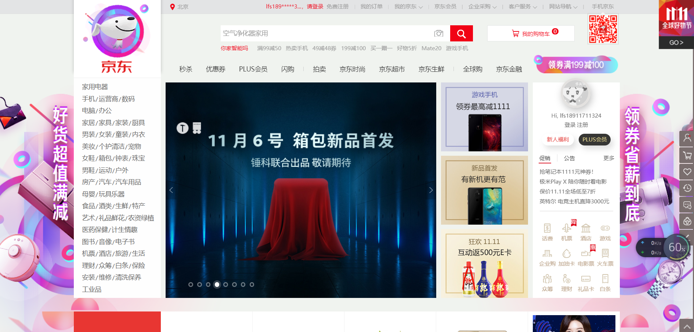
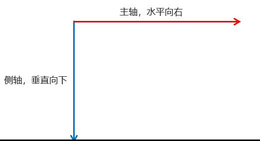
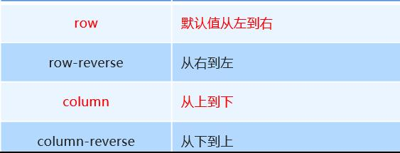
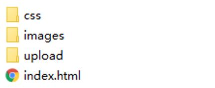
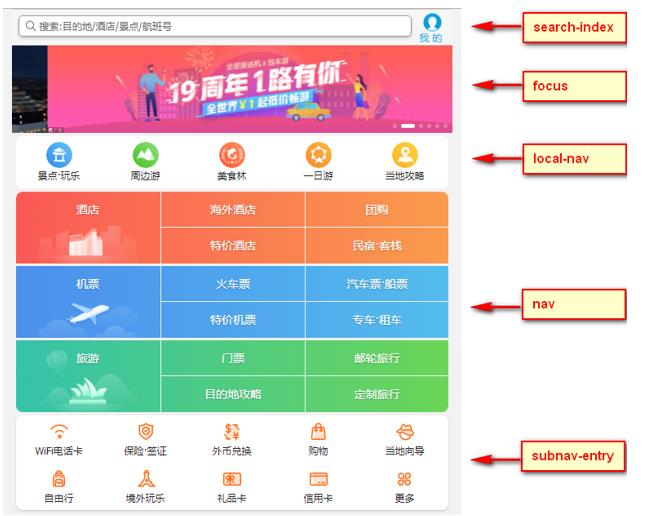
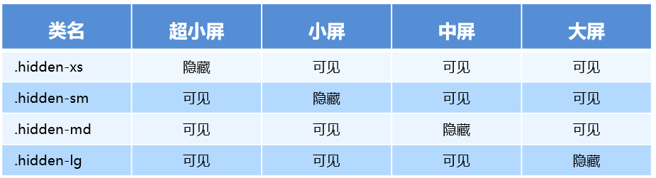

# 移动web开发流式布局

### 1.0 移动端基础

#### 1.1浏览器现状

 PC端常见浏览器：360浏览器、谷歌浏览器、火狐浏览器、QQ浏览器、百度浏览器、搜狗浏览器、IE浏览器。

移动端常见浏览器：UC浏览器，QQ浏览器，欧朋浏览器，百度手机浏览器，360安全浏览器，谷歌浏览器，搜狗手机浏览器，猎豹浏览器，以及其他杂牌浏览器。

国内的UC和QQ，百度等手机浏览器都是根据Webkit修改过来的内核，国内尚无自主研发的内核，就像国内的手机操作系统都是基于Android修改开发的一样。

**总结：兼容移动端主流浏览器，处理Webkit内核浏览器即可。**

#### 1.2 手机屏幕的现状

+ 移动端设备屏幕尺寸非常多，碎片化严重。
+ Android设备有多种分辨率：480x800, 480x854, 540x960, 720x1280，1080x1920等，还有传说中的2K，4k屏。
+ 近年来iPhone的碎片化也加剧了，其设备的主要分辨率有：640x960, 640x1136, 750x1334, 1242x2208等。
+ 作为开发者无需关注这些分辨率，因为我们常用的尺寸单位是 px 。

#### 1.3常见移动端屏幕尺寸


#### 1.4移动端调试方法

+ Chrome DevTools（谷歌浏览器）的模拟手机调试
+ 搭建本地web服务器，手机和服务器一个局域网内，通过手机访问服务器
+ 使用外网服务器，直接IP或域名访问

### 2.0 视口

视口（viewport）就是浏览器显示页面内容的屏幕区域。 视口可以分为布局视口、视觉视口和理想视口

#### 2.1 布局视口 layout viewport

一般移动设备的浏览器都默认设置了一个布局视口，用于解决早期的PC端页面在手机上显示的问题。

iOS, Android基本都将这个视口分辨率设置为 980px，所以PC上的网页大多都能在手机上呈现，只不过元素看上去很小，一般默认可以通过手动缩放网页。


#### 2.2视觉视口 visual viewport

字面意思，它是用户正在看到的网站的区域。注意：是网站的区域。

我们可以通过缩放去操作视觉视口，但不会影响布局视口，布局视口仍保持原来的宽度。


#### 2.3理想视口 ideal viewport

为了使网站在移动端有最理想的浏览和阅读宽度而设定

理想视口，对设备来讲，是最理想的视口尺寸

需要手动添写meta视口标签通知浏览器操作

meta视口标签的主要目的：布局视口的宽度应该与理想视口的宽度一致，简单理解就是设备有多宽，我们布局的视口就多宽

**总结：我们开发最终会用理想视口，而理想视口就是将布局视口的宽度修改为视觉视口**

#### 2.4meta标签


最标准的viewport设置

+ 视口宽度和设备保持一致
+ 视口的默认缩放比例1.0
+ 不允许用户自行缩放
+ 最大允许的缩放比例1.0
+ 最小允许的缩放比例1.0

### 3.0二倍图

#### 3.1物理像素&物理像素比

物理像素点指的是屏幕显示的最小颗粒，是物理真实存在的。这是厂商在出厂时就设置好了,比如苹果6 是  750* 1334

我们开发时候的1px 不是一定等于1个物理像素的

一个px的能显示的物理像素点的个数，称为物理像素比或屏幕像素比

如果把1张100*100的图片放到手机里面会按照物理像素比给我们缩放

lRetina（视网膜屏幕）是一种显示技术，可以将把更多的物理像素点压缩至一块屏幕里，从而达到更高的分辨率，并提高屏幕显示的细腻程度。

对于一张 50px * 50px 的图片,在手机或 Retina 屏中打开，按照刚才的物理像素比会放大倍数，这样会造成图片模糊

在标准的viewport设置中，使用倍图来提高图片质量，解决在高清设备中的模糊问题

通常使用二倍图， 因为iPhone 6 的影响背景图片 注意缩放问题

#### 3.2背景缩放background-size

background-size 属性规定背景图像的尺寸

```
background-size: 背景图片宽度 背景图片高度;
```

单位： 长度|百分比|cover|contain;

cover把背景图像扩展至足够大，以使背景图像完全覆盖背景区域。

contain把图像图像扩展至最大尺寸，以使其宽度和高度完全适应内容区域

### 4.0 移动开发选择和技术解决方案

#### 4.1移动端主流方案

1.单独制作移动端页面（主流）

通常情况下，网址域名前面加 m(mobile)
可以打开移动端。通过判断设备，如果是移动设备打开，则跳到移动端页面。  

也就是说，PC端和移动端为两套网站，pc端是pc断的样式，移动端在写一套，专门针对移动端适配的一套网站

京东pc端：




京东移动端：


2.响应式页面兼容移动端（其次）


响应式网站：即pc和移动端共用一套网站，只不过在不同屏幕下，样式会自动适配

#### 4.2 移动端技术解决方案

1.移动端浏览器兼容问题

移动端浏览器基本以 webkit 内核为主，因此我们就考虑webkit兼容性问题。

我们可以放心使用 H5 标签和 CSS3 样式。

同时我们浏览器的私有前缀我们只需要考虑添加 webkit 即可

2.移动端公共样式

移动端 CSS 初始化推荐使用 normalize.css/

Normalize.css：保护了有价值的默认值

Normalize.css：修复了浏览器的bug

Normalize.css：是模块化的

Normalize.css：拥有详细的文档

官网地址： <http://necolas.github.io/normalize.css/>

#### 4.3 移动端大量使用 CSS3盒子模型box-sizin

传统模式宽度计算：盒子的宽度 = CSS中设置的width + border + padding 

CSS3盒子模型：     盒子的宽度=  CSS中设置的宽度width 里面包含了 border 和 padding 

也就是说，我们的CSS3中的盒子模型， padding 和 border 不会撑大盒子了

```
/*CSS3盒子模型*/
box-sizing: border-box;
/*传统盒子模型*/
box-sizing: content-box;

```

移动端可以全部CSS3 盒子模型

PC端如果完全需要兼容，我们就用传统模式，如果不考虑兼容性，我们就选择 CSS3 盒子模型

#### 4.4移动端特殊样式

```
    /*CSS3盒子模型*/
    box-sizing: border-box;
    -webkit-box-sizing: border-box;
    /*点击高亮我们需要清除清除  设置为transparent 完成透明*/
    -webkit-tap-highlight-color: transparent;
    /*在移动端浏览器默认的外观在iOS上加上这个属性才能给按钮和输入框自定义样式*/
    -webkit-appearance: none;
    /*禁用长按页面时的弹出菜单*/
    img,a { -webkit-touch-callout: none; }

```

### 5.0移动端常见布局

移动端单独制作

+ 流式布局（百分比布局）
+ flex 弹性布局（强烈推荐）
+ less+rem+媒体查询布局
+ 混合布局

响应式

+ 媒体查询
+ bootstarp

流式布局：

流式布局，就是百分比布局，也称非固定像素布局。

通过盒子的宽度设置成百分比来根据屏幕的宽度来进行伸缩，不受固定像素的限制，内容向两侧填充。

流式布局方式是移动web开发使用的比较常见的布局方式。

# 移动web开发——flex布局

## 1.0传统布局和flex布局对比

### 1.1传统布局

+ 兼容性好
+ 布局繁琐
+ 局限性，不能再移动端很好的布局

### 1.2 flex布局

+ 操作方便，布局极其简单，移动端使用比较广泛
+ pc端浏览器支持情况比较差
+ IE11或更低版本不支持flex或仅支持部分

### 1.3 建议

+  如果是pc端页面布局，还是采用传统方式
+  如果是移动端或者是不考虑兼容的pc则采用flex

## 2.0 flex布局原理

+ flex 是 flexible Box 的缩写，意为"弹性布局"，用来为盒状模型提供最大的灵活性，任何一个容器都可以指定为 flex 布局。
+ 当我们为父盒子设为 flex 布局以后，子元素的 float、clear 和 vertical-align 属性将失效。
+ flex布局又叫伸缩布局 、弹性布局 、伸缩盒布局 、弹性盒布局 
+ 采用 Flex 布局的元素，称为 Flex 容器（flex

container），简称"容器"。它的所有子元素自动成为容器成员，称为 Flex 项目（flex
item），简称"项目"。

**总结**：就是通过给父盒子添加flex属性，来控制子盒子的位置和排列方式

## 3.0 父项常见属性

+ flex-direction：设置主轴的方向
+ justify-content：设置主轴上的子元素排列方式
+ flex-wrap：设置子元素是否换行  
+ align-content：设置侧轴上的子元素的排列方式（多行）
+ align-items：设置侧轴上的子元素排列方式（单行）
+ flex-flow：复合属性，相当于同时设置了 flex-direction 和 flex-wrap

### 3.1 flex-direction设置主轴的方向

+ 在 flex 布局中，是分为主轴和侧轴两个方向，同样的叫法有 ： 行和列、x 轴和y 轴
+ 默认主轴方向就是 x 轴方向，水平向右
+ 默认侧轴方向就是 y 轴方向，水平向下



+ 注意： 主轴和侧轴是会变化的，就看 flex-direction 设置谁为主轴，剩下的就是侧轴。而我们的子元素是跟着主轴来排列的

  

  

### 3.2 justify-content 设置主轴上的子元素排列方式


### 3.3 flex-wrap设置是否换行

+ 默认情况下，项目都排在一条线（又称”轴线”）上。flex-wrap属性定义，flex布局中默认是不换行的。
+ nowrap 不换行
+ wrap 换行

### 3.4 align-items 设置侧轴上的子元素排列方式（单行 ）

+ 该属性是控制子项在侧轴（默认是y轴）上的排列方式  在子项为单项（单行）的时候使用
+ flex-start 从头部开始
+ flex-end 从尾部开始
+ center 居中显示
+ stretch 拉伸

### 3.5 align-content  设置侧轴上的子元素的排列方式（多行）

设置子项在侧轴上的排列方式 并且只能用于子项出现 换行 的情况（多行），在单行下是没有效果的。


### 3.6 align-content 和align-items区别

+ align-items  适用于单行情况下， 只有上对齐、下对齐、居中和 拉伸
+ align-content适应于换行（多行）的情况下（单行情况下无效）， 可以设置 上对齐、下对齐、居中、拉伸以及平均分配剩余空间等属性值。 
+ 总结就是单行找align-items  多行找 align-content

### 3.7 flex-flow 属性是 flex-direction 和 flex-wrap 属性的复合属性

```
flex-flow:row wrap;
```

## 4.0 flex布局子项常见属性

+ flex子项目占的份数
+ align-self控制子项自己在侧轴的排列方式
+ order属性定义子项的排列顺序（前后顺序）

### 4.1  flex 属性

flex 属性定义子项目分配剩余空间，用flex来表示占多少份数。

```
.item {
    flex: <number>; /* 默认值 0 */
}

```

### 4.2 align-self控制子项自己在侧轴上的排列方式

align-self 属性允许单个项目有与其他项目不一样的对齐方式，可覆盖 align-items 属性。

默认值为 auto，表示继承父元素的 align-items 属性，如果没有父元素，则等同于 stretch。

````
span:nth-child(2) {
      /* 设置自己在侧轴上的排列方式 */
      align-self: flex-end;
}

````

### 4.3 order 属性定义项目的排列顺序

数值越小，排列越靠前，默认为0。

注意：和 z-index 不一样。

```
.item {
    order: <number>;
}
```

## 5.0 携程网首页案例制作

携程网链接：http://m.ctrip.com

1.技术选型

方案：我们采取单独制作移动页面方案

技术：布局采取flex布局

2.搭建相关文件夹



3.设置视口标签以及引入初始化样式

```
<meta name="viewport" content="width=device-width, user-scalable=no,initial-scale=1.0, maximum-scale=1.0, minimum-scale=1.0">

<link rel="stylesheet" href="css/normalize.css">
<link rel="stylesheet" href="css/index.css">
```

4.常用初始化样式

```
body {
  max-width: 540px;
  min-width: 320px;
  margin: 0 auto;
  font: normal 14px/1.5 Tahoma,"Lucida Grande",Verdana,"Microsoft Yahei",STXihei,hei;
  color: #000;
  background: #f2f2f2;
  overflow-x: hidden;
  -webkit-tap-highlight-color: transparent;
}

```

5.模块名字划分




 

# 移动web开发之rem布局

### rem基础

#### rem单位

rem (root em)是一个相对单位，类似于em，em是父元素字体大小。

不同的是rem的基准是相对于html元素的字体大小。

比如，根元素（html）设置font-size=12px; 非根元素设置width:2rem; 则换成px表示就是24px。

```
/* 根html 为 12px */
html {
   font-size: 12px;
}
/* 此时 div 的字体大小就是 24px */       
div {
    font-size: 2rem;
}
```

rem的优势：父元素文字大小可能不一致， 但是整个页面只有一个html，可以很好来控制整个页面的元素大小。

### 媒体查询

#### 什么是媒体查询

媒体查询（Media Query）是CSS3新语法。

+ 使用 @media查询，可以针对不同的媒体类型定义不同的样式
+ @media 可以针对不同的屏幕尺寸设置不同的样式
+ 当你重置浏览器大小的过程中，页面也会根据浏览器的宽度和高度重新渲染页面 
+ 目前针对很多苹果手机、Android手机，平板等设备都用得到多媒体查询

#### 媒体查询语法规范

+ 用 @media开头 注意@符号
+ mediatype  媒体类型
+ 关键字 and  not  only
+ media feature 媒体特性必须有小括号包含

```
@media mediatype and|not|only (media feature) {
    CSS-Code;
}
```

1. mediatype 查询类型

​       将不同的终端设备划分成不同的类型，称为媒体类型


2. 关键字

​       关键字将媒体类型或多个媒体特性连接到一起做为媒体查询的条件。

+ and：可以将多个媒体特性连接到一起，相当于“且”的意思。
+ not：排除某个媒体类型，相当于“非”的意思，可以省略。
+ only：指定某个特定的媒体类型，可以省略。    

3. 媒体特性

   每种媒体类型都具体各自不同的特性，根据不同媒体类型的媒体特性设置不同的展示风格。我们暂且了解三个。

   注意他们要加小括号包含

   

   

4. 媒体查询书写规则

   注意： 为了防止混乱，媒体查询我们要按照从小到大或者从大到小的顺序来写,但是我们最喜欢的还是从小到大来写，这样代码更简洁

   

   

   

### less 基础

#### 维护css弊端

CSS 是一门非程序式语言，没有变量、函数、SCOPE（作用域）等概念。

+ CSS 需要书写大量看似没有逻辑的代码，CSS 冗余度是比较高的。
+ 不方便维护及扩展，不利于复用。
+ CSS 没有很好的计算能力
+ 非前端开发工程师来讲，往往会因为缺少 CSS 编写经验而很难写出组织良好且易于维护的 CSS 代码项目。 

#### Less 介绍 

Less（LeanerStyle Sheets 的缩写）是一门 CSS扩展语言，也成为CSS预处理器。

做为 CSS的一种形式的扩展，它并没有减少CSS的功能，而是在现有的CSS语法上，为CSS加入程序式语言的特性。

它在CSS 的语法基础之上，引入了变量，Mixin（混入），运算以及函数等功能，大大简化了 CSS 的编写，并且降低了 CSS的维护成本，就像它的名称所说的那样，Less可以让我们用更少的代码做更多的事情。

Less中文网址：[http://](http://lesscss.cn/)[less](http://lesscss.cn/)[css.cn/](http://lesscss.cn/)

常见的CSS预处理器：Sass、Less、Stylus

一句话：Less是一门 CSS 预处理语言，它扩展了CSS的动态特性。

Less安装

①安装nodejs，可选择版本(8.0)，网址：<http://nodejs.cn/download/>

②检查是否安装成功，使用cmd命令（win10是window+r 打开运行输入cmd）  ---输入“node –v”查看版本即可

③基于nodejs在线安装Less，使用cmd命令“npm install -g less”即可

④检查是否安装成功，使用cmd命令“ lessc -v ”查看版本即可

Less 使用之变量

变量是指没有固定的值，可以改变的。因为我们CSS中的一些颜色和数值等经常使用。

```
@变量名:值;
```

+ 必须有@为前缀
+ 不能包含特殊字符
+ 不能以数字开头
+ 大小写敏感

```
@color: pink;
```

Less 编译 vocode Less 插件

Easy LESS 插件用来把less文件编译为css文件

安装完毕插件，重新加载下 vscode。

只要保存一下Less文件，会自动生成CSS文件。


Less 嵌套

```
// 将css改为less
#header .logo {
  width: 300px;
}

#header {
    .logo {
       width: 300px;
    }
}

```

如果遇见 （交集|伪类|伪元素选择器） ，利用&进行连接

```
a:hover{
    color:red;
}
a{
  &:hover{
      color:red;
  }
}
```

Less 运算

任何数字、颜色或者变量都可以参与运算。就是Less提供了加（+）、减（-）、乘（*）、除（/）算术运算。

```
/*Less 里面写*/
@witdh: 10px + 5;
div {
    border: @witdh solid red;
}
/*生成的css*/
div {
  border: 15px solid red;
}
/*Less 甚至还可以这样 */
width: (@width + 5) * 2;

```

+ 乘号（*）和除号（/）的写法  
+ 运算符中间左右有个空格隔开 1px + 5
+ 对于两个不同的单位的值之间的运算，运算结果的值取第一个值的单位 
+ 如果两个值之间只有一个值有单位，则运算结果就取该单位

### rem适配方案

1.让一些不能等比自适应的元素，达到当设备尺寸发生改变的时候，等比例适配当前设备。

2.使用媒体查询根据不同设备按比例设置html的字体大小，然后页面元素使用rem做尺寸单位，当html字体大小变化元素尺寸也会发生变化，从而达到等比缩放的适配。

技术方案：

1.less+rem+媒体查询

2.lflexible.js+rem

总结： 

两种方案现在都存在。

方案2 更简单，现阶段大家无需了解里面的js代码。

#### rem实际开发适配方案1

①假设设计稿是750px

②假设我们把整个屏幕划分为15等份（划分标准不一可以是20份也可以是10等份）

③每一份作为html字体大小，这里就是50px

④那么在320px设备的时候，字体大小为320/15就是  21.33px

⑤用我们页面元素的大小除以不同的 html字体大小会发现他们比例还是相同的

⑥比如我们以750为标准设计稿

⑦一个100*100像素的页面元素在  750屏幕下，  就是 100/ 50  转换为rem  是  2rem*2rem  比例是1比1

⑧320屏幕下，  html字体大小为21.33   则 2rem=  42.66px  此时宽和高都是 42.66  但是宽和高的比例还是 1比1

⑨但是已经能实现不同屏幕下  页面元素盒子等比例缩放的效果

总结：

①最后的公式：页面元素的rem值 =  页面元素值（px） /  （屏幕宽度  /  划分的份数）

②屏幕宽度/划分的份数就是 htmlfont-size 的大小

③或者：页面元素的rem值 =  页面元素值（px） /  html font-size 字体大小

### 苏宁首页

苏宁首页地址 ：[苏宁首页](m.suning.com)

1、 技术选型

方案：我们采取单独制作移动页面方案

技术：布局采取rem适配布局（less + rem  + 媒体查询）

设计图： 本设计图采用 750px 设计尺寸

2、搭建文件结构


3、设置视口标签以及引入初始化样式

```
<meta name="viewport" content="width=device-width, user-scalable=no,         initial-scale=1.0, maximum-scale=1.0, minimum-scale=1.0">

<link rel="stylesheet" href="css/normalize.css">
```

4、设置公共common.less文件

+ 新建common.less    设置好最常见的屏幕尺寸，利用媒体查询设置不同的html字体大小，因为除了首页其他页面也需要
+ 我们关心的尺寸有 320px、360px、375px、384px、400px、414px、424px、480px、540px、720px、750px
+ 划分的份数我们定为 15等份
+ 因为我们pc端也可以打开我们苏宁移动端首页，我们默认html字体大小为 50px，注意这句话写到最上面

### rem 适配方案2

手机淘宝团队出的简洁高效 移动端适配库

我们再也不需要在写不同屏幕的媒体查询，因为里面js做了处理

它的原理是把当前设备划分为10等份，但是不同设备下，比例还是一致的。

我们要做的，就是确定好我们当前设备的html 文字大小就可以了

比如当前设计稿是 750px， 那么我们只需要把 html 文字大小设置为 75px(750px / 10) 就可以

里面页面元素rem值： 页面元素的px 值 /  75  

剩余的，让flexible.js来去算

github地址：[https://github.com/amfe/lib-flexible](https://link.jianshu.com/?t=https://github.com/amfe/lib-flexible)

总结：

因为flexible是默认将屏幕分为10等分

但是当屏幕大于750的时候希望不要再去重置html字体了

所以要自己通过媒体查询设置一下

并且要把权重提到最高

VSCode  px 转换rem 插件 cssrem 

因为cssrem中css自动转化为rem是参照默认插件的16转换的所以需要自己配置


# 移动端WEB开发之响应式布局

### 1.0 响应式开发原理 

#### 1.1 响应式开发原理

就是使用媒体查询针对不同宽度的设备进行布局和样式的设置，从而适配不同设备的目的。

设备的划分情况：

+ 小于768的为超小屏幕（手机）
+ 768~992之间的为小屏设备（平板）
+ 992~1200的中等屏幕（桌面显示器）
+ 大于1200的宽屏设备（大桌面显示器）

#### 1.2 响应式布局容器

响应式需要一个父级做为布局容器，来配合子级元素来实现变化效果。

原理就是在不同屏幕下，通过媒体查询来改变这个布局容器的大小，再改变里面子元素的排列方式和大小，从而实现不同屏幕下，看到不同的页面布局和样式变化。

父容器版心的尺寸划分

+ 超小屏幕（手机，小于 768px）：设置宽度为 100%
+ 小屏幕（平板，大于等于 768px）：设置宽度为 750px
+ 中等屏幕（桌面显示器，大于等于 992px）：宽度设置为 970px
+ 大屏幕（大桌面显示器，大于等于 1200px）：宽度设置为 1170px 

但是我们也可以根据实际情况自己定义划分

###  2.0 bootstrap的介绍

#### 2.1Bootstrap简介

Bootstrap 来自 Twitter（推特），是目前最受欢迎的前端框架。Bootstrap 是基于HTML、CSS 和 JAVASCRIPT 的，它简洁灵活，使得 Web 开发更加快捷。

[中文网](lhttp://www.bootcss.com/)  [官网](lhttp://getbootstrap.com/)  [推荐网站](http://bootstrap.css88.com/)

框架：顾名思义就是一套架构，它有一套比较完整的网页功能解决方案，而且控制权在框架本身，有预制样式库、组件和插件。使用者要按照框架所规定的某种规范进行开发。

#### 2.2 bootstrap优点

+ 标准化的html+css编码规范
+ 提供了一套简洁、直观、强悍的组件
+ 有自己的生态圈，不断的更新迭代
+ 让开发更简单，提高了开发的效率

#### 2.3 版本简介

2.x.x：停止维护,兼容性好,代码不够简洁，功能不够完善。

3.x.x：目前使用最多,稳定,但是放弃了IE6-IE7。对 IE8 支持但是界面效果不好,偏向用于开发响应式布局、移动设备优先的WEB 项目。

4.x.x：最新版，目前还不是很流行

#### 2.4bootstrap基本使用

在现阶段我们还没有接触JS相关课程，所以我们只考虑使用它的样式库。

Bootstrap 使用四步曲： 

1. 创建文件夹结构  

   

   

2. 创建 html 骨架结构 

   ```
   <!DOCTYPE html>
   <html lang="zh-CN">
     <head>
       <meta charset="utf-8">
       <meta http-equiv="X-UA-Compatible" content="IE=edge">
       <meta name="viewport" content="width=device-width, initial-scale=1">
       <!-- 上述3个meta标签*必须*放在最前面，任何其他内容都*必须*跟随其后！ -->
       <title>Bootstrap 101 Template</title>
   
       <!-- Bootstrap -->
       <link href="css/bootstrap.min.css" rel="stylesheet">
   
       <!-- HTML5 shim and Respond.js for IE8 support of HTML5 elements and media queries -->
       <!-- WARNING: Respond.js doesn't work if you view the page via file:// -->
       <!--[if lt IE 9]>
         <script src="//cdn.bootcss.com/html5shiv/3.7.2/html5shiv.min.js"></script>
         <script src="//cdn.bootcss.com/respond.js/1.4.2/respond.min.js"></script>
       <![endif]-->
     </head>
     <body>
       <h1>你好，世界！</h1>
   
       <!-- jQuery (necessary for Bootstrap's JavaScript plugins) -->
       <script src="//cdn.bootcss.com/jquery/1.11.3/jquery.min.js"></script>
       <!-- Include all compiled plugins (below), or include individual files as needed -->
       <script src="js/bootstrap.min.js"></script>
     </body>
   </html>
   ```

   

3. 引入相关样式文件  

   ```
   <!-- Bootstrap 核心样式-->
   <link rel="stylesheet" href="bootstrap/css/bootstrap.min.css">
   ```

   

4. 书写内容 

   直接拿Bootstrap 预先定义好的样式来使用

   修改Bootstrap 原来的样式，注意权重问题

   学好Bootstrap 的关键在于知道它定义了哪些样式，以及这些样式能实现什么样的效果

#### 2.5 bootstrap布局容器

Bootstrap 需要为页面内容和栅格系统包裹一个 .container 或者.container-fluid 容器，它提供了两个作此用处的类。

.container

+ 响应式布局的容器  固定宽度
+ 大屏 ( >=1200px)  宽度定为 1170px
+ 中屏 ( >=992px)   宽度定为  970px
+ 小屏 ( >=768px)   宽度定为  750px
+ 超小屏  (100%) 

.container-fluid

+ 流式布局容器 百分百宽度
+ 占据全部视口（viewport）的容器。

#### 2.6 bootstrap栅格系统

Bootstrap提供了一套响应式、移动设备优先的流式栅格系统，随着屏幕或视口（viewport）尺寸的增加，系统会自动分为最多12列。

栅格系统用于通过一系列的行（row）与列（column）的组合来创建页面布局，你的内容就可以放入这些创建好的布局中。

+ 按照不同屏幕划分为1~12 等份
+ 行（row） 可以去除父容器作用15px的边距
+ xs-extra small：超小； sm-small：小；  md-medium：中等； lg-large：大；
+ 列（column）大于 12，多余的“列（column）”所在的元素将被作为一个整体另起一行排列
+ 每一列默认有左右15像素的 padding
+ 可以同时为一列指定多个设备的类名，以便划分不同份数  例如 class="col-md-4 col-sm-6"

栅格嵌套

栅格系统内置的栅格系统将内容再次嵌套。简单理解就是一个列内再分成若干份小列。我们可以通过添加一个新的 .row 元素和一系列 .col-sm-* 元素到已经存在的 .col-sm-*
元素内。

```
<!-- 列嵌套 -->
 <div class="col-sm-4">
    <div class="row">
         <div class="col-sm-6">小列</div>
         <div class="col-sm-6">小列</div>
    </div>
</div>

```

列偏移

使用 .col-md-offset-* 类可以将列向右侧偏移。这些类实际是通过使用 * 选择器为当前元素增加了左侧的边距（margin）。

```
 <!-- 列偏移 -->
  <div class="row">
      <div class="col-lg-4">1</div>
      <div class="col-lg-4 col-lg-offset-4">2</div>
  </div>

```

列排序

通过使用 .col-md-push-* 和 .col-md-pull-* 类就可以很容易的改变列（column）的顺序。

```
 <!-- 列排序 -->
  <div class="row">
      <div class="col-lg-4 col-lg-push-8">左侧</div>
      <div class="col-lg-8 col-lg-pull-4">右侧</div>
  </div>

```

响应式工具

为了加快对移动设备友好的页面开发工作，利用媒体查询功能，并使用这些工具类可以方便的针对不同设备展示或隐藏页面内容。



### 3.0 阿里百秀案例制作

#### 3.1 技术选型

方案：我们采取响应式页面开发方案

技术：bootstrap框架

设计图： 本设计图采用 1280px 设计尺寸

项目结构搭建

Bootstrap 使用四步曲： 

1. 创建文件夹结构  

2. 创建 html 骨架结构  
3. 引入相关样式文件  
4. 书写内容 

container宽度修改

因为本效果图采取 1280的宽度， 而Bootstrap 里面 container宽度 最大为 1170px，因此我们需要手动改下container宽度

```
 /* 利用媒体查询修改 container宽度适合效果图宽度  */
  @media (min-width: 1280px) { 
    .container { 
	width: 1280px; 
     } 
   }

```

